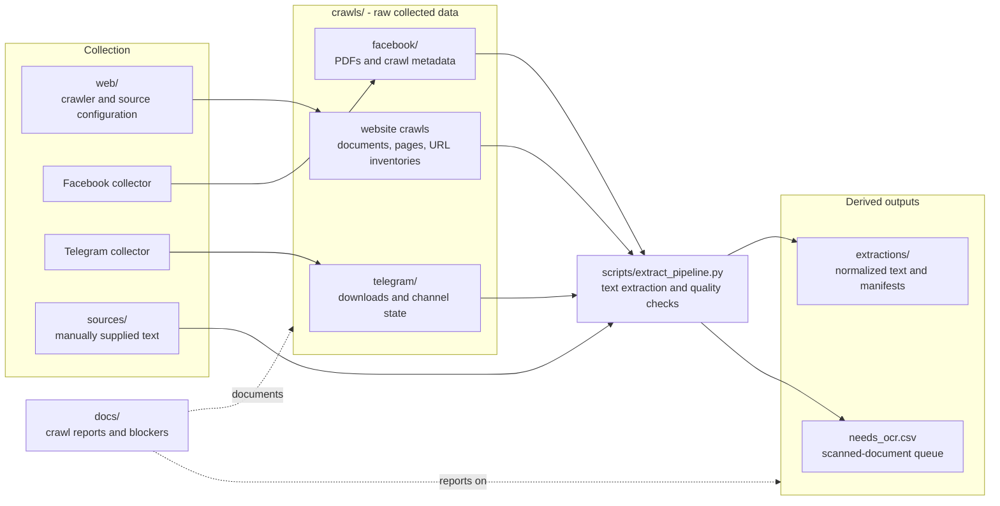

# Bahdini Crawler

Data collection for **Badini (Bahdini) Kurdish** LLM fine-tuning. This repo
contains three collectors, an extraction pipeline, and the metadata of
everything they harvested:

1. **Web crawler** ([web/crawler.py](web/crawler.py)): crawls six Badini
   websites, maps their full page structure, and downloads every publicly
   linked document (PDF, DOC/DOCX, XLS/XLSX, PPT/PPTX, ZIP and more).
2. **Facebook group scraper** ([crawls/facebook/](crawls/facebook/)): a Playwright-based
   scraper for the "Partokxana Electroni" (Electronic Library) Facebook
   group.
3. **Telegram channel downloader** ([crawls/telegram/](crawls/telegram/)): a Telethon-based
   downloader that pulls every document attachment from three Badini book
   channels, and also follows links posted in messages (direct files, Google
   Drive, MediaFire, Dropbox).
4. **Extraction pipeline**
   ([scripts/extract_pipeline.py](scripts/extract_pipeline.py)): turns the
   harvested PDFs plus manually supplied text drops
   ([sources/](sources/)) into a normalized plain-text corpus under
   [extractions/](extractions/), one folder per source, preprocessed with
   [KLPT](https://github.com/sinaahmadi/klpt); scanned PDFs are flagged for
   a future OCR / Google Document AI pass.

The downloaded files themselves (~25 GB) and the extracted text are kept out
of git; this repo holds the code, configuration, structure maps, manifests,
and reports.

## Where to find what

| I want to... | Go to |
|---|---|
| See what was collected and the token estimate | [docs/CRAWL_REPORT.md](docs/CRAWL_REPORT.md) |
| See what went wrong (blocked site, malware finding, rate limits) | [docs/BLOCKERS.md](docs/BLOCKERS.md) |
| Set up Google Document AI and run reproducible batch OCR | [docs/DOCUMENT_AI_OCR_GUIDE.md](docs/DOCUMENT_AI_OCR_GUIDE.md) |
| See the source sites, their robots.txt and sitemaps | [web/config/base_urls.md](web/config/base_urls.md) |
| Browse a site's page structure | `crawls/<site>/site_structure.md` |
| Look up a downloaded file's origin URL | `crawls/<site>/documents.csv` |
| Check the Facebook scrape and its Badini/Arabic tagging | [crawls/facebook/](crawls/facebook/) (`pdf_table.md`, `manifest.json`) |
| Look up a Telegram download's source message or link | `crawls/telegram/downloads/<channel>/.download_state.json` |
| Use the extracted text corpus / see per-document quality stats | [extractions/README.md](extractions/README.md) |
| See which PDFs need OCR (Document AI queue) | [extractions/needs_ocr.csv](extractions/needs_ocr.csv) |
| Re-run or extend a crawl | [Quick start](#quick-start) below |

## Results at a glance

| Collector | Yield |
|---|---|
| Web crawler (4 of 6 sites yielded documents) | 4,485 documents, ~7.4 GB, ~10,000 pages mapped |
| Facebook group scrape | 1,318 PDFs, ~6 GB (mixed Badini/Arabic/Sorani, tagged in `pdf_table.md`) |
| Telegram channels (3 book channels) | 1,925 documents, ~12 GB (150 of them via posted links) |
| Extractable Badini text (web PDFs, measured by sampling) | ~7.1M words, roughly 9 to 14M LLM tokens |
| Locked in scanned PDFs, needs OCR | potentially 5 to 14M more words |

### Web sources

| Source | Type | Yield |
|---|---|---|
| [spirez.org](https://spirez.org/) | Badini literary magazine | 2,291 PDFs (mostly scanned issues) |
| [zcks.uoz.edu.krd](https://zcks.uoz.edu.krd/) | Zakho Center for Kurdish Studies | 713 PDFs (books, theses, journals) |
| [govarabadinan.blogspot.com](https://govarabadinan.blogspot.com/) | Badini blog magazine | HTML posts only, structure mapped |
| [xaniagency.com](https://xaniagency.com/) | Kurdish news agency (WordPress) | HTML articles only, crawl stopped early |
| [govarametin.com](https://govarametin.com/) | Badini magazine | blocked at ISP level, see [docs/BLOCKERS.md](docs/BLOCKERS.md) |

### Telegram sources

| Channel | Yield |
|---|---|
| [t.me/Badini_book](https://t.me/Badini_book) | 993 documents, ~5.7 GB |
| [t.me/jihana_pertuken_pdf](https://t.me/jihana_pertuken_pdf) | 774 documents, ~4.6 GB |
| [t.me/pertok_badini](https://t.me/pertok_badini) | 158 documents, ~1.6 GB |

## Repository layout

The `crawls/` directory is the canonical location for all collected raw data,
including web crawls, Facebook, and Telegram. Cross-source processing lives in
`scripts/`; derived text sits in `extractions/`.




```
Bahdini_Crawler/
├── README.md                  <- you are here
│
├── web/                       # web crawler
│   ├── crawler.py             # entry point (site configs in SITES at the top)
│   └── config/
│       ├── base_urls.md       # source sites, robots.txt and sitemap notes
│       └── govarabadinan.xml  # locally supplied sitemap for the Blogspot source
│
├── sources/                   # manually supplied raw text drops
│   └── sh2_unicodefixed/      # 241 Bahdini .txt files (unicode-fixed)
│
├── scripts/                   # cross-source processing
│   ├── extract_pipeline.py    # PDFs/raw text -> normalized corpus in extractions/
│   └── token_estimate.py      # PDF sampling + Kurdish text classification
│
├── crawls/                    # all raw crawler data
│   ├── crawl_summary.json     # machine-readable per-site summary
│
│
│   ├── facebook/              # "Partokxana Electroni" group scrape
│   │   ├── facebook_pdf_downloader.py  # Playwright scraper (login, scan, download)
│   │   ├── pdf_table.md       # per-PDF list with is_bahdini / is_arabic tags
│   │   ├── manifest.json      # per-post download log (makes runs resumable)
│   │   ├── permalinks.json    # harvested group post IDs
│   │   ├── legacy/            # superseded first version of the scraper
│   │   └── pdfs/              # downloaded PDFs (NOT in git, ~6 GB)
│   ├── telegram/              # Telegram channel downloader
│   │   ├── download_telegram_documents.py  # Telethon downloader (attachments + posted links)
│   │   ├── run_downloader.sh  # launcher (conda env, unbuffered output)
│   │   ├── requirements.txt   # Telethon, cryptg, aiohttp
│   │   ├── .telegram/         # login session (NOT in git, private)
│   │   └── downloads/         # one folder per channel
│   │       ├── <channel>/     # downloaded books (NOT in git, ~12 GB)
│   │       └── <channel>/.download_state.json  # manifest: message ids, sizes, link outcomes
│   └── <site>/
│       ├── documents/         # downloaded files (NOT in git, ~7.4 GB)
│       ├── pages.jsonl        # one JSON record per crawled page
│       ├── urls.csv           # flat URL inventory
│       ├── documents.csv      # doc URL -> source page -> local file
│       ├── site_structure.md  # hierarchical page tree
│       └── errors.log         # per-URL failures
│
├── extractions/               # normalized text corpus, one folder per source (own README)
│   ├── <source>/_manifest.jsonl  # per-document status + quality stats
│   ├── <source>/*.txt         # extracted text (NOT in git, regenerate via the pipeline)
│   ├── extraction_summary.json
│   └── needs_ocr.csv          # scanned PDFs for a future Document AI pass
│

├── document_ai_sample/        # 1.5% representative sample for Google Document AI auditing
│
├── docs/
│   ├── CRAWL_REPORT.md        # full crawl results + Badini token estimate
│   └── BLOCKERS.md            # blockers and errors encountered
│
└── logs/                      # raw session logs of crawl / extraction runs
```

## Quick start

### Web crawler

Requires Python 3.10+ with `requests`, `beautifulsoup4`, `lxml`.

```bash
python3 web/crawler.py              # crawl every configured site
python3 web/crawler.py zcks uod     # crawl selected sites only
```

Each site is one dict in the `SITES` list in [web/crawler.py](web/crawler.py) with
optional overrides (`delay`, `workers`, `max_pages`, `sitemaps`,
`extra_seeds`, `force_http`). Adding a new source means adding one entry.

Pipeline per site: robots.txt (respected, sitemap declarations harvested),
recursive sitemap parsing, BFS link crawl to depth 10, document detection by
extension / OJS download routes / Content-Type, and a priority download queue
so page backlogs can never starve document downloads.

### Token estimate

Requires `pdftotext` (poppler-utils).

```bash
python3 scripts/token_estimate.py
```

### Extraction pipeline

Requires a conda env with `pymupdf` and `klpt`
(`conda run -n ai pip install pymupdf klpt`):

```bash
conda run --no-capture-output -n ai python -u scripts/extract_pipeline.py
```

Incremental: only documents whose output text is missing are processed.
See [extractions/README.md](extractions/README.md) for the output layout,
per-document statuses, and the needs-OCR queue.

### Facebook scraper

See the dedicated [README](crawls/facebook/README.md)
(needs Playwright and a Facebook account that is a member of the group).

### Telegram downloader

Requires the `ai` conda environment with the packages in
[crawls/telegram/requirements.txt](crawls/telegram/requirements.txt). One-time setup: create
an application at <https://my.telegram.org/apps> and export its credentials
(never commit the API hash):

```bash
export TELEGRAM_API_ID='your_numeric_api_id'
export TELEGRAM_API_HASH='your_api_hash'
export TELEGRAM_PHONE='+964...'
```

Then:

```bash
crawls/telegram/run_downloader.sh                 # scan + download the three channels
crawls/telegram/run_downloader.sh --dry-run       # preview without changing state
crawls/telegram/run_downloader.sh --channel https://t.me/example   # another channel
```

The first run asks for the Telegram login code; the session is stored in
`crawls/telegram/.telegram/` and must stay private. Runs are resumable: scans are
checkpointed per channel, partial files continue where they stopped, and
completed files are verified by size and PDF magic bytes before being kept.

Speed comes from working around per-connection throttling on both transports:
Telegram documents are fetched as 1 MiB chunks spread over eight parallel
MTProto connections per data center, and large linked files use up to six
parallel HTTP range requests. Posted links are followed automatically (direct
files, Google Drive including the virus-scan interstitial, Google Docs,
MediaFire download pages, Dropbox); dead and non-document links are remembered
in `.download_state.json` and never probed twice. See
`crawls/telegram/run_downloader.sh --help` for tuning flags
(`--concurrent-downloads`, `--parallel-connections`, `--download-retries`,
`--force-rescan`).

## Next steps

- OCR the ~1,730 scanned spirez PDFs (largest untapped Badini pool)
- Add article-text extraction to persist HTML content from govarabadinan
  and xaniagency
- Re-crawl govarametin.com from an unfiltered network
- Finish Badini/Arabic tagging in the Facebook scrape's `pdf_table.md`
- Re-run the Telegram downloader periodically to pick up new posts
  (incremental: only new messages are scanned)
- Fetch the 9 Google Drive folders linked from Telegram posts by hand
  (folder listings are not crawled automatically)
