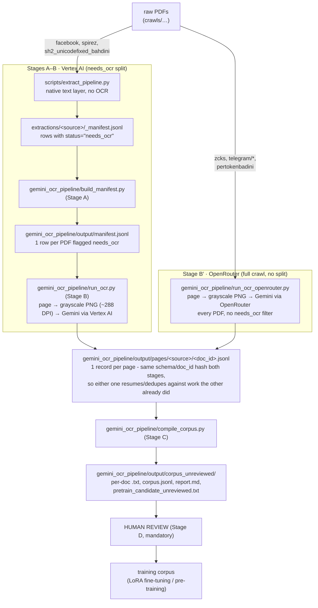

# OCR Guide: Scanned PDFs to Bahdini Corpus

**This document is the single source of truth for OCR in this repository.**
It takes a new contributor (or an implementation agent) from zero Google
Cloud setup to a reviewed Bahdini text corpus, end to end.

> **Decision record (2026-07-15).** This guide originally described a Google
> Document AI batch workflow. After a side-by-side pilot, the project
> **diverged to Gemini visual transcription through Vertex AI** as the
> production OCR path. Document AI remains only as a retired reference in
> [Appendix A](#appendix-a-document-ai-retired-path). Everything else in this
> guide describes the Gemini pipeline in
> [`gemini_ocr_pipeline/`](../gemini_ocr_pipeline/).
>
> **Decision record (2026-07-16).** For the three richest, most-trusted
> crawls - `zcks`, the three `telegram/downloads/*` folders, and
> `pertokenbadini` - the project **dropped the `needs_ocr` split** and moved
> to OCR-ing every page of every PDF directly, over **OpenRouter** instead of
> Vertex AI. Two things drove this:
>
> 1. A resume-log audit ([`gemini_ocr_pipeline/output/logs/telegram_zcks_ptb_w12_resume_*.log`](../gemini_ocr_pipeline/output/logs/))
>    found `run_ocr.py` was silently dropping documents: when
>    `fitz.open()` reports 0 pages for a corrupt/malformed PDF,
>    `process_document()` returned early with no log line and no JSONL
>    record - the document just vanished from the run with no trace. 9 of
>    114 `telegram_jihana_pertuken_pdf` documents (all 20–200MB scanned
>    novels) were silently lost this way.
> 2. The `needs_ocr` split itself was judged not worth the complexity for
>    these three sources - the "safe" native-text documents it excludes
>    still deserve a from-image transcription for corpus consistency, so all
>    pages now go through Gemini regardless of what the text layer looked
>    like.
>
> This path is documented in [Stage B′](#4b-stage-b-openrouter-full-crawl-ocr-zcks-telegram-pertokenbadini).
> The original Vertex/`needs_ocr` path (Stages A–B below) is unchanged and
> still owns `facebook`, `spirez`, and `sh2_unicodefixed_bahdini`.

## Why the project diverged to Gemini

An A/B comparison (pages 3–13 of a legacy Facebook scan, plus later smoke
tests; runner: [`scripts/compare_document_ai_gemini.py`](../scripts/compare_document_ai_gemini.py))
found:

| Criterion | Document AI Enterprise OCR | Gemini `gemini-3.1-flash-lite` (Vertex) |
|---|---|---|
| Bahdini character fidelity | Dropped Kurdish distinctions, word splitting, substitutions | Visibly better; remaining ڤ/ق confusions fixed by prompt `v4` |
| Corrupted legacy text layers | Must disable native parsing | Irrelevant: pages are sent as images only |
| Language filtering | None; transcribes everything | Prompt gate refuses non-Badini pages, then skips the document |
| Cost per page | $0.00150 flat | ≈ $0.0009–0.0015 per transcribed page; near zero for gated non-Badini books |
| Whole-queue estimate (201k pages) | ≈ $302 | ≤ $181, lower in practice because non-Badini books exit early |

Two standing technical rules came out of that evaluation:

1. **Never send a PDF to a model.** Many legacy PDFs carry malformed embedded
   text layers; a model that reads native PDF text inherits the corruption.
   Always render pages to images first. The pipeline does this for you.
2. **OCR output is never automatically training data.** Everything lands in
   an `_unreviewed` area and requires human review before promotion.

## Architecture



`facebook`, `spirez`, and `sh2_unicodefixed_bahdini` still go through the
`needs_ocr` split (Stage A → B): the native extraction pipeline is faster and free for
files with a usable text layer; only documents it flags `needs_ocr` enter
this pipeline. `gemini_ocr_pipeline/output/` is Git-ignored and fully
regenerable except for the Gemini responses themselves, which cost money -
treat `output/pages/` as the valuable artifact and back it up before bulk
deleting anything.

## 1. One-time cloud setup (A to Z)

Identifiers used throughout (already provisioned for this project):

| Setting | Value |
|---|---|
| Google Cloud project | `bahdini-data` (project number `377090410782`) |
| API | `aiplatform.googleapis.com` (Vertex AI) |
| Model | `gemini-3.1-flash-lite`, called with `vertexai=True`, `location="global"` |
| Authentication | Application Default Credentials (ADC) |
| Conda environment | `ai` (never create a project-local venv) |
| Buckets / processors | **None needed** for the Gemini path |

Steps, in order. Skip any step that is already verified.

1. **Install and authenticate the gcloud CLI.**

   ```bash
   gcloud auth login
   gcloud config set project bahdini-data
   gcloud config list --format='text(core.project,core.account)'
   ```

2. **Confirm billing and set a budget alert before any large run.**

   ```bash
   gcloud billing projects describe bahdini-data \
     --format='yaml(billingAccountName,billingEnabled)'
   ```

   Then create a budget with alerts (for example $50) in Console → Billing →
   Budgets & alerts. Vertex AI calls to Google-owned Gemini models are
   expected to be eligible for the $300 Google Cloud welcome credit; the
   AI Studio Gemini API is **not**. Verify in Billing → Reports after the
   pilot that usage is actually drawing from the credit.

3. **Enable the Vertex AI API.**

   ```bash
   gcloud services enable aiplatform.googleapis.com --project=bahdini-data
   gcloud services list --enabled --project=bahdini-data \
     --filter='config.name=aiplatform.googleapis.com' \
     --format='value(config.name)'
   ```

4. **Create Application Default Credentials.**

   ```bash
   gcloud auth application-default login
   gcloud auth application-default print-access-token >/dev/null && echo "ADC is valid"
   ```

   Credentials are stored outside the repository at
   `~/.config/gcloud/application_default_credentials.json`. Never commit
   credentials. If a local browser cannot complete the login, run
   `gcloud auth application-default login --no-browser`, run the printed
   `--remote-bootstrap` command on a browser-capable machine, and paste the
   authorization **response** (not the URL) back into the first terminal.

5. **Install the Python dependencies in the `ai` environment.**

   ```bash
   conda activate ai
   python -m pip install --upgrade google-genai pymupdf
   ```

6. **Verify the whole chain with one tiny call.**

   ```bash
   conda run --no-capture-output -n ai python - <<'PY'
   from google import genai
   client = genai.Client(vertexai=True, project="bahdini-data", location="global")
   r = client.models.generate_content(model="gemini-3.1-flash-lite", contents="ping")
   print("Vertex AI OK:", r.text[:40])
   PY
   ```

   This exercises ADC, API enablement, project selection, and model access at
   once. If it fails, see the [troubleshooting map](#7-troubleshooting-map).

## 1B. One-time OpenRouter setup (Stage B′ only)

Only needed for `run_ocr_openrouter.py` - Stages A/B above (Vertex) don't use
this.

| Setting | Value |
|---|---|
| API | `https://openrouter.ai/api/v1/chat/completions` (OpenAI-compatible) |
| Model | `google/gemini-3.1-flash-lite` (OpenRouter's slug for the same model Stage B calls on Vertex; confirmed present via `GET /api/v1/models`) |
| Authentication | API key in `OPENROUTER_API_KEY`, loaded from the environment or the repo-root `.env` file |
| Conda environment | `ai` (same as Stage B; needs `aiohttp`, already installed) |

1. **Put the key in `.env` at the repo root** (never commit it - `.env` is
   gitignored):

   ```text
   OPENROUTER_API_KEY=sk-or-v1-...
   ```

   `ocr_config.load_dotenv_key()` checks the real environment first, then
   falls back to parsing this file, so exporting the variable in your shell
   also works and takes precedence.

2. **Check the key's credit balance and expiry before any real run** - this
   is the step that would have caught the pilot's $10 cap immediately:

   ```bash
   python3 - <<'PY'
   key = None
   with open(".env") as f:
       for line in f:
           if line.startswith("OPENROUTER_API_KEY="):
               key = line.strip().split("=", 1)[1].strip().strip('"').strip("'")
   import json, urllib.request
   req = urllib.request.Request("https://openrouter.ai/api/v1/auth/key",
                                 headers={"Authorization": f"Bearer {key}"})
   print(json.dumps(json.load(urllib.request.urlopen(req, timeout=15)), indent=2))
   PY
   ```

   Look at `limit` / `limit_remaining` (a hard per-key credit cap, `null` if
   unlimited) and `expires_at`. **Never** print or log the key itself - this
   script only ever prints the response.

3. **Verify the whole chain with one tiny page.**

   ```bash
   conda run --no-capture-output -n ai python3 -u \
     gemini_ocr_pipeline/run_ocr_openrouter.py --source pertokenbadini \
     --doc "<some .pdf path substring>" --concurrency 2 --doc-concurrency 1 \
     --render-workers 2 --batch-size 2 --budget-usd 0.05
   ```

   Confirms the key, the request shape, and that `--budget-usd` actually
   stops dispatch. Pick a `--doc` substring you know isn't already fully
   OCR'd (check `gemini_ocr_pipeline/output/pages/<source>/` - resume logic
   silently no-ops on a document whose pages are already done).

## 2. Configuration and provenance rules

All knobs live in [`gemini_ocr_pipeline/ocr_config.py`](../gemini_ocr_pipeline/ocr_config.py):
model, Vertex project/location, rendering resolution (≈288 DPI grayscale,
long side capped at 3400 px), pricing constants, and the transcription
prompt.

The prompt is **versioned** (`PROMPT_VERSION`, currently `v4`) and every page
record stores the version that produced it. Rules:

- Any change to the prompt, model, or rendering that can affect output
  **must** bump `PROMPT_VERSION`.
- `v3` introduced the language gate: the model answers
  `[NOT_BADINI: <language>]` instead of transcribing pages whose body text is
  Arabic, Sorani, Latin-script Kurmanji, Persian, Turkish, or English.
- `v4` added the confusable-letter dot-count rule after a smoke test showed
  systematic ڤ→ق substitutions; on the test page it moved counts from
  ڤ=8/ق=10 to ڤ=18/ق=1 with the single remaining ق being genuinely correct.
- The pricing constants ($0.30 / $1.35 per million input/output tokens)
  reproduce the pilot's measured cost but are **estimates** - verify against
  the current Vertex AI price list before trusting absolute dollar numbers.

## 3. Stage A: Build the work queue

```bash
conda run --no-capture-output -n ai python gemini_ocr_pipeline/build_manifest.py
```

Reads every `extractions/<source>/_manifest.jsonl`, keeps rows with
`status="needs_ocr"` whose PDF still exists on disk, and writes
`gemini_ocr_pipeline/output/manifest.jsonl` (one row per document with
source, relative path, stable `doc_id`, page and byte counts). Missing files
are counted and reported, not fatal - sources with incomplete downloads
(for example `pertokenbadini`) simply queue what exists.

Re-run Stage A whenever new downloads finish or the extraction pipeline is
re-run. It is cheap and idempotent. Queue at the time of writing: **2,869
documents / 201,327 pages** (spirez ≈ 65% of documents).

## 4. Stage B: Run OCR

The runner is resumable and safe to interrupt at any point: every finished
page is already on disk, and a re-run resumes exactly where it stopped.

```bash
# pilot: a bounded number of pages
conda run --no-capture-output -n ai python -u gemini_ocr_pipeline/run_ocr.py \
  --source zcks --max-pages 50 --workers 2

# production, per source
conda run --no-capture-output -n ai python -u gemini_ocr_pipeline/run_ocr.py \
  --source spirez --workers 4
```

| Flag | Meaning |
|---|---|
| `--source SRC` | limit to one source (repeatable) |
| `--doc SUBSTRING` | only documents whose path contains the substring |
| `--max-docs N` | stop after N documents |
| `--max-pages N` | global page budget for this run (use for pilots) |
| `--workers N` | concurrent Gemini requests (default 2) |
| `--skip-after N` | language gate: skip the rest of a document after N consecutive non-Badini pages (default 5; 0 disables) |
| `--ignore-doc-skips` | re-attempt documents previously skipped as non-Badini |
| `--keep-images` | keep rendered PNGs under `output/images/<doc_id>/` |
| `--dry-run` | render and record pages without calling Gemini |

Every page attempt appends one JSONL record to
`output/pages/<source>/<doc_id>.jsonl` containing the model, prompt version,
image SHA-256 and pixel size, finish reason, token usage, estimated cost,
timestamp, status, and the raw transcription. Page statuses:

| Status | Meaning | Retried on re-run? |
|---|---|---|
| `ok` | transcription received | no |
| `no_text` | model answered `[NO_TEXT]` (cover, pure image) | no |
| `blank` | page image was blank; Gemini never called | no |
| `not_badini` | model answered `[NOT_BADINI: <language>]` | no |
| `empty` | empty response (for example token-limit cutoff) | yes |
| `error` | exception after 5 retries with backoff, **or** (as of 2026-07-16) `page: 0` for a PDF that failed to open or reported 0 pages | yes |
| `dry_run` | rendered only | yes |
| `doc_skipped` | record with `page: 0`; the language gate abandoned the document | only with `--ignore-doc-skips` |

Before 2026-07-16, a corrupt/malformed PDF (`fitz.open()` succeeds but
reports 0 pages, or raises) made `process_document()` return early with
**no** JSONL record and no log line - the document silently vanished from
the queue. It now always writes a `page: 0`, `status: "error"` record with a
reason, so a rerun-and-diff or a `grep '"status": "error"'` across
`output/pages/**/*.jsonl` surfaces it. This is the same fix applied to
`run_ocr_openrouter.py` - see [Stage B′](#4b-stage-b-openrouter-full-crawl-ocr-zcks-telegram-pertokenbadini).

The language gate is the main cost control: a non-Badini book costs a handful
of gated pages (a few output tokens each) instead of a full transcription.
Verified example: a 1,002-page Arabic novel cost $0.0024 total. Blank and
`no_text` pages are neutral - they neither extend nor break a non-Badini run,
so an Arabic book with an ornamental cover is still caught.

## 4B. Stage B′: OpenRouter full-crawl OCR (zcks, telegram, pertokenbadini)

[`gemini_ocr_pipeline/run_ocr_openrouter.py`](../gemini_ocr_pipeline/run_ocr_openrouter.py)
replaces Stages A+B for `zcks`, `telegram_badini_book`,
`telegram_jihana_pertuken_pdf`, `telegram_pertok_badini`, and
`pertokenbadini`. There is no manifest-build step: the script walks
`ocr_config.FULL_CRAWL_SOURCES` (one directory per source, under `crawls/`)
directly with `rglob("*.pdf")` every time it runs, so there's nothing to go
stale. It writes to the exact same `output/pages/<source>/<doc_id>.jsonl`
files as Stage B (`doc_id` is the same `sha1(source/relative_path)[:16]`
scheme), so:

- Documents already OCR'd under the old `needs_ocr` queue are recognized as
  done and never re-billed.
- Stage C (`compile_corpus.py`) needs zero changes - it just reads more
  `pages/` files than before.
- The two backends (Vertex, OpenRouter) can safely be run against the same
  source in different sessions; whichever ran first "wins" the page.

### Why it's fast: two-level async concurrency

`run_ocr.py` processes documents one at a time, with a `ThreadPoolExecutor`
only for the page-batch inside each document. `run_ocr_openrouter.py`
instead runs everything through one `asyncio` event loop with two
independent semaphores:

- `--doc-concurrency` (default 12) - how many documents are being worked on
  at once.
- `--concurrency` (default 24) - how many OpenRouter HTTP requests are in
  flight at once, shared across *all* documents. This is the real
  throughput knob; raise it until OpenRouter starts returning `429`s (the
  runner backs off and retries automatically, same 5-attempt exponential
  backoff as Stage B) or increase `--render-workers` if PyMuPDF rendering
  becomes the bottleneck instead.

The per-document not-Badini skip heuristic (`--skip-after`, same default 5)
still works exactly like Stage B - it's evaluated after each
`--batch-size`-page group finishes, using that document's own accumulated
statuses, independent of how many *other* documents happen to be running
concurrently.

### Usage

```bash
# smoke test: one tiny, guaranteed-uncapped-cost run
conda run --no-capture-output -n ai python3 -u \
  gemini_ocr_pipeline/run_ocr_openrouter.py --source pertokenbadini \
  --doc "do3a.pdf" --concurrency 2 --doc-concurrency 1 --budget-usd 0.05

# budget-capped pilot across all 5 sources, interleaved
conda run --no-capture-output -n ai python3 -u \
  gemini_ocr_pipeline/run_ocr_openrouter.py --budget-usd 9.5 \
  --concurrency 40 --doc-concurrency 20 --render-workers 12 --batch-size 8

# production, once the key has real credit, source by source
conda run --no-capture-output -n ai python3 -u \
  gemini_ocr_pipeline/run_ocr_openrouter.py --source zcks --concurrency 40
```

| Flag | Meaning |
|---|---|
| `--source SRC` | limit to one source (repeatable); default: all 5 `FULL_CRAWL_SOURCES` |
| `--doc SUBSTRING` | only documents whose path contains the substring |
| `--max-docs N` | stop after queuing N documents (applied after shuffling) |
| `--budget-usd N` | stop dispatching new requests once cumulative estimated cost reaches `$N`; already-in-flight requests still finish, so actual spend overshoots slightly - leave headroom below any hard per-key credit cap |
| `--concurrency N` | concurrent OpenRouter requests in flight (default 24) |
| `--doc-concurrency N` | documents being worked on at once (default 12) |
| `--render-workers N` | thread pool size for PyMuPDF page rendering (default 8) |
| `--batch-size N` | pages sent concurrently per document before re-checking the not-Badini skip heuristic (default 6) |
| `--skip-after N` | same language gate as Stage B (default 5; 0 disables) |
| `--ignore-doc-skips` | re-attempt documents previously skipped as non-Badini or errored |
| `--no-shuffle` | process documents in directory order instead of a fixed shuffle; shuffling (the default) is what lets a `--budget-usd` cap sample all 5 sources instead of draining `zcks` alphabetically first |

### Budget enforcement is two layers deep

1. **Local, best-effort:** after every completed page, cumulative
   `est_cost_usd` (using `OPENROUTER_INPUT_USD_PER_M` /
   `OPENROUTER_OUTPUT_USD_PER_M` in `ocr_config.py`) is compared against
   `--budget-usd`; crossing it sets a stop flag that's checked before every
   new render/request, so the run winds down within one batch.
2. **Hard, server-side:** a `402` response from OpenRouter (credit
   exhausted) also sets the stop flag immediately and records the page as
   `error` with the response body. This is the real backstop - always check
   the key's `limit_remaining` (Section 1B) before assuming `--budget-usd`
   alone protects a shared/low-credit key.

### Verified (2026-07-16 smoke tests)

- One real page through OpenRouter: correct Bahdini transcription returned,
  cost `$0.000541` for `1685` input / `80` output tokens - cheaper per page
  than the Vertex pilot's earlier estimate ($0.30/$1.35 per M vs
  OpenRouter's $0.25/$1.50 per M, and this page's token counts ran smaller).
- `--budget-usd 0.05` against a real document: dispatched pages until
  `$0.0501`, then stopped cleanly with the in-flight batch still completing
  and no further requests sent.
- A known corrupt file (`telegram_jihana_pertuken_pdf/جیهانا سوفیایێ.pdf`,
  one of the 9 silently-dropped documents that started this investigation)
  now produces `{"page": 0, "status": "error", "error": "0-page/corrupt
  PDF"}` instead of vanishing.
- At real pilot scale (`--concurrency 40`, `--render-workers 12`), a rare
  native crash in libmupdf itself (glibc "double free", not a Python
  exception) took down the whole process at ~7,000 pages, then again within
  seconds in a smaller repro - root-caused and fixed by moving rendering to
  a `ProcessPoolExecutor` with automatic pool replacement on
  `BrokenProcessPool`. A follow-up stress test survived two more worker
  crashes and finished with a clean summary. Full account in [Project
  status: 2026-07-16](#project-status-2026-07-16).

## 5. Stage C: Compile the corpus

```bash
conda run --no-capture-output -n ai python gemini_ocr_pipeline/compile_corpus.py
```

Assembles all page records into `output/corpus_unreviewed/`:

- `<source>/<document>.txt` - pages joined with `\n\f\n` (same separator as
  the native extraction corpus), normalized with the same NFKC + KLPT rules
  as `extract_pipeline.py` so both corpora can be mixed (`--no-normalize` to
  keep raw Gemini output; note KLPT also folds Arabic-Indic digits like ١١٤
  to 114).
- `corpus.jsonl` - one record per document: page counts by status,
  completeness, character count, `[unclear]` count, Arabic-script and
  Kurdish-letter ratios, estimated cost, `review_status: "unreviewed"`, and a
  classification: `kurdish`, `not_badini`, `arabic_not_kurdish`, `low_text`,
  or `not_arabic_script`.
- `report.md` - per-source totals plus a "review first" list (non-Kurdish
  classifications, heavy `[unclear]` use, incomplete documents).
- `pretrain_candidate_unreviewed.txt` - concatenation of complete,
  Kurdish-classified documents.

Stage C is a pure local re-aggregation: re-run it as often as you like, it
never calls the API.

## 6. Stage D: Human review and promotion (mandatory)

Classification prioritizes review; it never replaces it. Before any text is
used for training:

1. Read `report.md`; resolve every "review first" entry (re-run failed pages,
   confirm `not_badini` skips by spot-checking one page image with
   `--keep-images`, decide what to do with `low_text` fragments).
2. Sample transcribed pages against the source PDF - render the page and
   compare. Check specifically: Kurdish letters `ێ ۆ ڕ ڵ ڤ پ چ ژ گ ە`,
   reading order across columns, poetry line breaks, and that the model did
   not paraphrase or "repair" anything.
3. Only after review, copy or reference the accepted `.txt` files into the
   training candidate set. For LoRA fine-tuning, build instruction pairs from
   the reviewed per-document files; for pre-training, use the reviewed
   concatenated file.
4. Record what was accepted (a simple reviewed-list file next to the corpus
   is enough) so a later compile re-run cannot silently change the training
   set.

Acceptance checks for a pilot batch:

| Check | Expected outcome |
|---|---|
| Kurdish character fidelity | ڤ/ق, پ/ب, چ/ج, گ/ک, ژ/ز, ێ/ی, ۆ/و all correct in samples |
| Reading order | Sampled paragraphs follow the visible page order |
| No hallucination | Nothing in the transcript that is not on the page; `[unclear]` used instead of guesses |
| Language gate precision | Spot-checked `not_badini` pages really are non-Badini |
| Provenance | Every output maps to one source PDF, page, prompt version, and image hash |
| Re-run safety | Re-running the same command submits no completed page again |
| Failure visibility | Errors exist as page records, not silent gaps |

## 7. Troubleshooting map

| Symptom | Likely cause | Resolution |
|---|---|---|
| `DefaultCredentialsError` | ADC absent or expired | `gcloud auth application-default login`, verify with `print-access-token` |
| `PermissionDenied` / API disabled | Vertex AI API off, wrong project | Enable `aiplatform.googleapis.com` in `bahdini-data`; check `gcloud config list` |
| `NOT_FOUND` for the model | Model name typo or unavailable in `global` | Check `GEMINI_MODEL` in `ocr_config.py` |
| `429 RESOURCE_EXHAUSTED` | Quota / rate limit | Lower `--workers`; the runner already retries with exponential backoff |
| Many `empty` pages, `finish_reason: MAX_TOKENS` | Extremely dense pages hit the output cap | Raise `MAX_OUTPUT_TOKENS` in `ocr_config.py`; affected pages retry on the next run |
| Many `error` records for one PDF | Corrupt/truncated download | Confirm with `python -m fitz` open; re-download, re-run extraction, Stage A, Stage B |
| Transcripts look "too clean" (headers gone, digits Western) | Working as designed | Prompt drops running headers/page numbers; KLPT converts digits - use `--no-normalize` if unwanted |
| A Badini book was skipped as `not_badini` | Gate false positive (for example long Arabic preface) | Re-run with `--ignore-doc-skips --doc '<name>'`, review, consider raising `--skip-after` |
| Costs higher than estimated | Pricing constants are estimates | Compare Billing → Reports against `est_cost_usd` sums; update constants in `ocr_config.py` |
| Browser login fails on Linux | Headless/remote session | Use the `--no-browser` remote-bootstrap flow described in step 1.4 |
| `run_ocr_openrouter.py: OPENROUTER_API_KEY not set` | Key isn't in the environment or `.env` | Add `OPENROUTER_API_KEY=...` to the repo-root `.env` (Section 1B); never export it in a way that gets logged |
| Run stops early with `"Stopped early: budget cap..."` and few pages done | Either `--budget-usd` was hit, or OpenRouter returned `402` (key credit exhausted) | Check the key's `limit_remaining` via `GET /api/v1/auth/key` (Section 1B, step 2) before assuming it's just the local `--budget-usd` |
| `run_ocr_openrouter.py` prints a page result then nothing for a document | Normal - resumed documents whose pages are all already done, or ones already marked `doc_skipped`/`error`, return silently with no output | Check `output/pages/<source>/<doc_id>.jsonl` directly rather than expecting a print line for every queued document |
| A resume-run log shows far fewer pages for a source than a full manifest scan | The log is a resume: earlier runs in the same session already finished most of that source | Compare unique document counts against `output/pages/<source>/*.jsonl` on disk, not just one log file, before concluding a run under-processed |

## 8. Operational checklist

Before a production-scale run:

- [ ] Billing enabled, welcome-credit linkage confirmed, budget alert set.
- [ ] `aiplatform.googleapis.com` enabled in `bahdini-data`; ADC valid.
- [ ] `google-genai` and `pymupdf` installed in the `ai` conda environment.
- [ ] Stage A re-run after the latest downloads; queue counts reviewed.
- [ ] A pilot (`--max-pages` ≈ 300 across mixed sources) passed Stage D
      review, including the acceptance checks above.
- [ ] `PROMPT_VERSION` is what the pilot validated; no unversioned prompt edits.
- [ ] Production runs go source by source with a bounded `--workers`.
- [ ] `output/pages/` is backed up (it is the paid artifact).
- [ ] Nothing from `corpus_unreviewed/` enters training without Stage D review.

Before a production-scale **Stage B′ (OpenRouter)** run:

- [ ] `OPENROUTER_API_KEY` is in `.env` or the environment.
- [ ] Key's `limit_remaining` (Section 1B, step 2) covers the run's
      estimated cost - the full `zcks`/`telegram`/`pertokenbadini` queue was
      sized at ~302,600 pages / ~$500 on 2026-07-16; check `--budget-usd`
      against actual remaining credit before every run, not just the first.
- [ ] `expires_at` on the key is safely after the run is expected to finish.
- [ ] A small `--budget-usd` smoke test passed (Section 1B, step 3) with a
      `--doc` substring confirmed **not** already OCR'd.
- [ ] `--concurrency` / `--doc-concurrency` chosen with rate limits in mind;
      watch the first few minutes of output for repeated `error` statuses
      (a sign of `429`s outpacing the retry backoff) before walking away.
- [ ] `aiohttp` installed in the `ai` conda environment (`pymupdf` already
      is, shared with Stage B).

## Appendix A: Document AI (retired path)

Document AI Enterprise OCR was fully set up and evaluated before the project
diverged to Gemini. It is **not used** for production OCR. Kept for
reference and possible re-evaluation:

- Processor: `bahdini-enterprise-ocr`, type `OCR_PROCESSOR`, state `ENABLED`,
  location `us`, processor ID `6c2e13121ee43056`, resource name
  `projects/377090410782/locations/us/processors/6c2e13121ee43056`.
- API `documentai.googleapis.com` is enabled; no Cloud Storage buckets were
  ever created (the evaluation used synchronous processing only).
- Comparison runner:
  [`scripts/compare_document_ai_gemini.py`](../scripts/compare_document_ai_gemini.py),
  which processes a page range with both providers and saves artifacts for
  side-by-side review. Use it to re-benchmark if either provider changes
  materially.
- If Document AI is ever revisited: keep `enable_native_pdf_parsing=False`
  (legacy text layers are corrupt), use the location-specific endpoint
  (`us-documentai.googleapis.com`), reconstruct text via text anchors by
  joining every `text_segments` slice (missing `start_index` means 0), and
  keep `\n\f\n` page separators. Batch processing would additionally need
  input/output buckets co-located with the processor and
  `roles/storage.objectViewer` / `roles/storage.objectCreator` for
  `service-377090410782@gcp-sa-documentai.iam.gserviceaccount.com`.
- Retirement rationale: more Bahdini character errors than Gemini, no
  language gating, and ≈ 40% higher cost at equal or worse quality
  (measured $0.00150/page vs ≈ $0.00090/page in the pilot).

## Project status: 2026-07-15

Gemini pipeline built and smoke-tested end to end (a 4-page Badini magazine
document transcribed correctly under prompt `v4`; a 1,002-page Arabic novel
gated and skipped for $0.0024). Work queue: 2,869 documents / 201,327 pages,
all present on disk. The full production run has **not** been started; the
next action is the ~300-page mixed-source pilot followed by Stage D review.

## Project status: 2026-07-16

**Vertex/`needs_ocr` queue (Stages A–B).** A resume-log audit found the
`zcks` / `telegram_pertok_badini` / `telegram_badini_book` / `pertokenbadini`
portion of the `needs_ocr` queue was actually **98% complete**
(403 of 412 documents; the earlier "resume" log only *looked* sparse because
most work had already finished in prior runs in the same session - see the
new troubleshooting row on reading resume logs). The other 2%
(`telegram_jihana_pertuken_pdf`, 9 of 114 documents) turned out to be
genuinely corrupt PDFs (20–200MB scanned novels, `fitz` reports 0 pages)
that `process_document()` was silently dropping - the bug fixed in this
change (see the 2026-07-16 decision record at the top of this document).

**New Stage B′ (OpenRouter, full crawl, no `needs_ocr` split).** Built and
smoke-tested (Section 4B). Sizing the full job - every PDF under
`crawls/{zcks,telegram/downloads/*,pertokenbadini}` - found **2,601 valid
documents, ~302,600 pages** (plus the 10 corrupt ones, now caught instead of
lost), estimated at **~$500** at OpenRouter's `google/gemini-3.1-flash-lite`
pricing. The `OPENROUTER_API_KEY` in `.env` turned out to have only a **$10
hard credit cap** (checked via `GET /api/v1/auth/key` - see Section 1B) -
nowhere near enough for the full job. Decision: run a `--budget-usd 9.5`
pilot now (interleaved across all 5 sources via the default shuffle) as a
real-scale validation, and hold the full ~302K-page/~$500 run until the key
is topped up.

**Pilot outcome: it crashed, not stopped.** ~27 minutes and ~6,993 pages
into the run (6,635 `ok`, across 53 documents, 0 corrupt-PDF errors hit),
the whole Python process aborted with a glibc `free(): double free detected
in tcache 2` - a native crash, not a Python exception, so no `Run summary`
printed. All 6,993 already-written page records were verified intact (every
`output/pages/**/*.jsonl` line across the repo parses as valid JSON; nothing
was corrupted mid-write). OpenRouter's own billing (`GET /api/v1/auth/key`)
is what confirmed real spend: **$8.52** of the $10 cap.

Root-caused by reproducing it in isolation: a pure-`fitz`-plus-lock repro
(16 threads, 90 renders, no aiohttp) did **not** crash, and rendering the
specific page the crash log last mentioned worked fine on its own - ruling
out a simple cross-thread race or one reliably-poisoned file. Two more
timed stress tests at the same concurrency (`--render-workers 12`, `40`
concurrent OpenRouter requests) reproduced the same abort within seconds,
including once **inside a single-threaded `ProcessPoolExecutor` worker**,
pointing to a rare, page-content-triggered crash somewhere in libmupdf's C
code itself rather than a bug in this pipeline's Python threading.

**Fix, verified working:** `run_ocr_openrouter.py` now renders in a
`ProcessPoolExecutor` (a crashing worker takes down only itself, not the
orchestrator) and `render_in_executor()` detects `BrokenProcessPool`,
transparently swaps in a fresh pool, and retries. A follow-up stress test at
the same `--concurrency 40` hit **two more** worker crashes and recovered
from both automatically, finishing with a clean `Run summary` (214 `ok`,
7 `error`, $0.28 spent against a $0.12 cap - see the budget-overshoot note
below). Section 4B's docstring and code comments record this history.

**Budget-overshoot note:** at `--concurrency 40` the local `--budget-usd`
check overshot its target by ~2.3× ($0.28 actual vs. $0.12 cap) because many
requests are in flight when the cap trips. Leave proportionally more
headroom below any hard credit limit at high concurrency, or lower
`--concurrency` as the cap approaches.

**Key state at end of session:** $1.05 of the original $10 remains (two
stress tests cost a further ~$0.5 validating the fix) - not enough for
another meaningful run. `output/pages/` already holds the pilot's 6,993
real transcribed pages permanently (resuming will skip them).
**Next actions:** (1) get `OPENROUTER_API_KEY` topped up for the full
~302K-page/~$500 job (the crash fix should now make an unattended run
survivable), or run it through Vertex AI instead (unlimited via GCP
billing, same `ocr_config.PROMPT`/model, just slower per the
two-level-concurrency comparison in Section 4B); (2) at the start of the
next large run, budget in a lower `--concurrency` near the cap to reduce
overshoot; (3) Stage D review before anything from either
backend enters training data.
