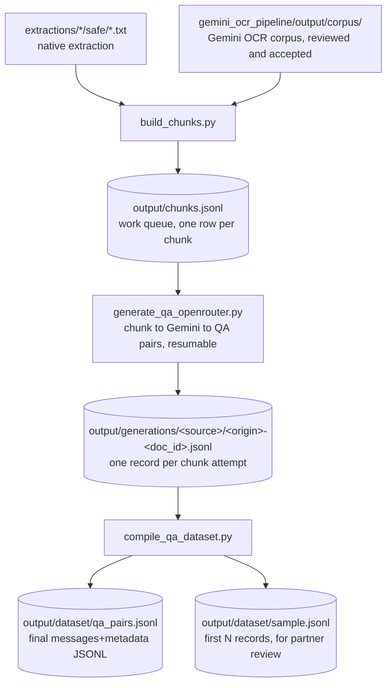

# QA-pair generation pipeline

Turns the clean Bahdini text corpus into instruction-tuning QA pairs for the
partner's Gemma 4 31B IT LoRA fine-tune, in the JSONL schema confirmed over
email (a `messages` list plus a `metadata` object). Mirrors the shape of
[gemini_ocr_pipeline/](../gemini_ocr_pipeline/): versioned prompt/config,
JSONL work queue, resumable per-document generation records, a compile step.

[gemma_tokenizer.py](gemma_tokenizer.py) is shared by the chunking and
compile stages: it loads the real `google/gemma-4-31B-it` tokenizer so every
token count in this pipeline (chunk sizes, final record lengths) is the
actual number of tokens Gemma will see, not a character-based guess. See
"The chunk queue" below for why that turned out to matter.

## Stages



## The chunk queue

```bash
python3 qa_generation/build_chunks.py
```

Source pool, by design (see
[discover_safe_docs](build_chunks.py#L129-L151) and
[discover_ocr_docs](build_chunks.py#L152-L173)), both included
unconditionally:

- `extractions/<source>/safe/*.txt`: native PDF text extraction, classified
  `safe` by `scripts/extract_pipeline.py`.
- `gemini_ocr_pipeline/output/corpus/`: rows with `classification ==
  "kurdish"`. This corpus has been reviewed and accepted (see
  [gemini_ocr_pipeline/README.md](../gemini_ocr_pipeline/README.md) and
  [docs/DOCUMENT_AI_OCR_GUIDE.md](../docs/DOCUMENT_AI_OCR_GUIDE.md)'s Stage D).

Chunking is paragraph-aware: [split_paragraphs](build_chunks.py#L37-L46)
splits on the extraction pipeline's page-break `\f` markers, then blank
lines. [chunk_text](build_chunks.py#L87-L128) then greedily packs paragraphs
up to [qa_config.TARGET_CHUNK_TOKENS](qa_config.py#L50-L63) (900, cap 1050,
floor 120), and [hard_split](build_chunks.py#L59-L86) with
[token_hard_cut](build_chunks.py#L47-L58) handle the rare oversized
paragraph. Sized so the *prompt* side of a QA record (system + question +
context) lands near the partner's ~1,000-token mean; see "Confirmed with the
partner" below for why the answer isn't part of that budget.

**Token counts are real, not estimated.** [gemma_tokenizer.py](gemma_tokenizer.py)
loads the actual `google/gemma-4-31B-it` tokenizer (already cached locally,
no model weights needed, just the tokenizer files) and every
chunk/paragraph/sentence is tokenized for real while packing, via
[count_tokens_batch](gemma_tokenizer.py#L66-L74) so a full run over the
corpus takes a few minutes (batched per document, see
[build_chunks.py main()](build_chunks.py#L174-L260)). This replaced an
earlier char-based estimate ([qa_config.CHARS_PER_TOKEN](qa_config.py#L24-L49))
that assumed ~3.2 chars/token from a generic words/chars rule of thumb;
measured against the real tokenizer, Bahdini Arabic-script text actually
runs **~1.6 chars/token**, roughly twice as dense as that guess assumed.
`CHARS_PER_TOKEN` now holds that measured value and is used only as a
fallback if the real tokenizer cannot be loaded (offline, transformers
missing, gated repo not accepted); every function in `gemma_tokenizer.py`
degrades to it transparently, with a one-time warning, so the pipeline still
runs either way.

## Text-quality gate: legacy-font corruption

Chunking alone doesn't verify a document is actually meaningful text --
that was inherited from `extract_pipeline.py`'s document-level classifier,
and turned out not to hold for a large slice of the `safe_extraction` pool.
Random inspection of real chunks found documents like
`telegram_pertok_badini/چارینەیێن+بابا+طاهری.pdf` producing pure
character soup:

```text
ل ل ل ل / م & م & م & م & / S* S* S* S*
```

The manifest for that document shows `presentation_form_ratio: 0.078` and
plausible Kurdish-letter counts -- `extract_pipeline.py`'s corruption check
(>20% Unicode presentation forms) doesn't catch this class of problem at
all, because it's a legacy Kurdish font substituting the *wrong* Unicode
characters entirely, not presentation-form variants. The letter-frequency
statistics still look like real Kurdish; the character sequence doesn't
spell real words.

What actually separates it cleanly: the real Gemma tokenizer's chars/token
on a document's own chunks. The already-reviewed `ocr_corpus` pool (verified
clean by inspection, since Gemini transcribes from the rendered page image
rather than trusting the PDF's font) sits overwhelmingly at 1.9-2.2
chars/token; the corrupted `safe_extraction` documents sit at 1.0-1.5,
matching known garbled examples measured directly (1.18, 1.46) against
known clean ones (1.94). A per-chunk check on this was tried first and
rejected: one genuinely garbled document had individual chunks ranging from
0.12 to 0.52 purely from line-wrapping noise, so a per-chunk cutoff would
have let a lot of it through. The per-document **median** across a
document's own chunks is what actually separates cleanly, so
[qa_config.MIN_DOC_CHARS_PER_TOKEN](qa_config.py#L65-L81) (1.5) gates whole
documents in [build_chunks.py main()](build_chunks.py#L209-L215), reusing
the token counts already computed for chunk sizing -- no extra tokenizer
calls.

Current run over both source pools, gate applied: 5,370 documents seen,
**369 skipped as likely corrupted** (almost all `safe_extraction` -- see the
per-source breakdown in `output/chunks_report.md`), producing **254,872
chunks (~189.1M real tokens)** from the survivors, split `ocr_corpus`
166,169 / `safe_extraction` 88,703.

**A second, separate bug turned up while verifying this fix:** `document_id`
is intentionally the same across both pools for the same underlying file
(`qa_config.doc_id` and `gemini_ocr_pipeline`'s `ocr_config.doc_id` use the
same hash on purpose, "so ids line up across pipelines"). That's fine on its
own, but 626 documents genuinely exist in *both* pools (the OCR pipeline
re-transcribes some "safe"-sources for consistency, per its own README), and
`chunk_id` used to be built from `document_id` alone -- so for those 626
documents, a `safe_extraction` chunk and an `ocr_corpus` chunk could end up
with the identical `chunk_id`. That would have silently corrupted
`compile_qa_dataset.py`'s chunk-text lookup (a plain `dict` keyed by
`chunk_id`) and `generate_qa_openrouter.py`'s resumability tracking (both
origins' generation attempts landing in the same per-document file). Found
by checking chunk_ids for collisions after the quality-gate rebuild: **41,457
colliding ids across 82,914 chunks, 32.5% of the whole queue.** Fixed by
including `origin` in both the chunk_id (`build_chunks.py` line 219) and the
per-document generation file name (`output/generations/<source>/<origin>-<document_id>.jsonl`,
`generate_qa_openrouter.py`); verified zero collisions in the current
254,872-chunk file.

## A third corruption class: stray control/PUA characters (fixed)

`MIN_DOC_CHARS_PER_TOKEN` (above) catches wholesale character-soup
corruption, but there's a second, distinct failure mode from the same root
cause that it does not catch: individual stray non-printable characters
scattered inside otherwise-clean chunks. Found by opening
`output/chunks.jsonl` in a pager and noticing a boxed control-character
glyph mixed into real Bahdini text; investigated in
[`investigate_chunk_control_chars.ipynb`](investigate_chunk_control_chars.ipynb)
(run with the `ai` conda kernel — has pandas/matplotlib/jupyter; the base
env doesn't).

**Original scope** (measured against the pre-fix `output/chunks.jsonl`):
374 of ~4,359 documents (3.93% of 254,872 chunks) carried at least one
genuine non-printable character. Three different mechanisms turned up,
across two rounds of investigation:

- **`Cc` cp1252 mojibake** (39 documents): PDF fonts using Windows'
  `WinAnsiEncoding` (cp1252) — curly quotes, em-dashes — decoded without
  translation, so bytes `0x80`-`0x9F` survive as raw C1 control codes
  instead of the character they were meant to be. Deterministically
  recoverable via `bytes([n]).decode("cp1252")`.
- **`Co` Private Use Area glyphs** (344 documents): custom/symbol/legacy
  Kurdish fonts with no (or a broken) `ToUnicode` CMap in the PDF — the
  same underlying "font glyph doesn't map to correct Unicode" problem
  behind the character-soup case above, just a different symptom. Of these,
  315 documents only showed PUA as standalone decoration (safe to strip);
  29 showed it mid-word, between two Arabic-script letters — i.e. an
  actual letter got silently replaced, the same class of bug
  `MIN_DOC_CHARS_PER_TOKEN` was built to catch, just invisible to that
  particular check.
- **Raw C0 control codes** (found *after* the first fix pass, verifying the
  rebuilt corpus turned up a residual 307 chunks / 27 documents the fix
  above didn't touch): the same font-substitution failure landing in the
  `0x00`-`0x1F` range instead — e.g. `رئی\x19\x19\x19\x19س` (repeated `0x19`
  clusters sitting mid-word). No cp1252-style recovery table applies to this
  range; unlike decorative PUA, a C0 control code has no legitimate
  standalone use in body text at all, so any occurrence is treated as a
  corruption signal, never silently stripped.

**The through-line, and the one rule that matters for any future case like
this**: never blanket-strip an unrecognized character class. `Co`/PUA had a
genuine decorative-use majority (bullets) alongside real letter
substitution — collapsing that distinction would have silently deleted real
words in the 29 mid-word documents.

**Why the existing gate misses this**: affected chunks' chars/token ratio
(mean 1.84) sits only slightly below unaffected chunks (mean 2.02), nowhere
near the 1.5 cutoff — a handful of stray characters gets averaged out by an
otherwise-normal ~900-token chunk. `Cf`-category characters (`U+06DD`
Arabic end-of-ayah, `U+200E`/`U+200F` bidi marks, `U+200D` ZWJ) look
superficially similar under a naive "non-printable" scan but are legitimate
Bahdini/Arabic-script content, not corruption — don't include `Cf` in any
future corruption check built from this.

**Root cause, confirmed**: predates this pipeline entirely. The corrupted
bytes are already present in `extractions/facebook/safe/*.txt` (the output
of `scripts/extract_pipeline.py`'s `extract_pdf()`, from an earlier
extraction run) — `build_chunks.py` and `generate_qa_openrouter.py` never
touch byte-level encoding, only text/whitespace. `extract_pipeline.py`'s
`clean_text()` runs NFKC + KLPT Kurdish normalization and nothing else; it
has no handling for either corruption mechanism above. Confirmed by origin:
11.66% of `safe_extraction`-origin chunks affected vs. 0.36% of
`ocr_corpus`-origin chunks — almost exclusive to the native PDF text layer,
since Gemini OCR reads the rendered page image and never depends on the
PDF's internal font encoding.

**Status: fixed.** `clean_text()`, `text_stats()`, and `classification()` in
`scripts/extract_pipeline.py` now handle all three mechanisms:
`recover_cp1252_controls()` deterministically repairs `Cc` mojibake;
`handle_pua_chars()` strips decorative `Co` but leaves mid-word `Co` in
place and flags it; `count_stray_c0_controls()` flags any residual C0
control code. Both flags route the whole document to `ocr_needed` via
`classification()`, exactly like the existing `MIN_DOC_CHARS_PER_TOKEN`
gate — this is now a permanent, first-class check, not a one-off patch, so
any future extraction run (a new crawl, a re-run) gets it automatically.

Applied to the already-extracted corpus with
[`scripts/backfill_char_corruption_fix.py`](../scripts/backfill_char_corruption_fix.py)
— rewrites `extractions/*/safe/*.txt` in place using the fixed
`clean_text()`, refreshes each manifest record's stats, then calls
`classify_source()` to physically move any newly-flagged document from
`safe/` to `ocr_needed/`. Entirely local (re-processes already-extracted
text, no PDF re-parsing, no network/API calls) — **$0**.

**Before/after** (`output/chunks_report.md`, two backfill passes — cp1252 +
PUA first, then the C0 extension after verification turned up the
residual):

| | before | after |
|---|---|---|
| documents seen | 5,370 | 5,219 (151 reclassified to `ocr_needed`) |
| docs skipped as garbled (`MIN_DOC_CHARS_PER_TOKEN`) | 369 | 264 (105 *fewer* — stray characters were dragging otherwise-clean documents under the 1.5 cutoff; the fix rescued them) |
| chunks written | 254,872 | 246,515 (-3.3%) |
| context tokens | 189,053,622 | 183,119,057 (-3.1%) |
| chunks with real corruption (`Cc`/`Co`/`Cs`, `safe_extraction` origin) | 10,026 (374 docs) | **0** |
| chunks with real corruption (any origin) | 10,026 | 8, all in `ocr_corpus` — a separate, untouched pipeline (Gemini OCR doesn't depend on PDF font encoding, so this fix doesn't apply there; a different, much smaller, unrelated residual) |

**Impact on the already-recorded pilot generation**: of 255 real chunk
attempts recorded before the fix (`output/generations/`), 245 (96%) still
match a `chunk_id` in the rebuilt `chunks.jsonl` and stay valid; 10 (4%)
were orphaned by chunk-boundary shifts and will be silently regenerated as
new pending chunks on the next `generate_qa_openrouter.py` run — a few
cents of redundant spend, not data loss.

## Generation

```bash
python3 qa_generation/generate_qa_openrouter.py --max-chunks 20   # a quick sample first
python3 qa_generation/generate_qa_openrouter.py --budget-usd 25 --concurrency 16
```

[run()](generate_qa_openrouter.py#L193-L245) calls Gemini through OpenRouter
(reuses `OPENROUTER_API_KEY` from `.env`, same as
`gemini_ocr_pipeline/run_ocr_openrouter.py`) with the prompt in
[qa_config.QA_GENERATION_PROMPT_TEMPLATE](qa_config.py#L117-L161) (prompt
version `v2`), requesting `--pairs-per-chunk` (default 3) QA pairs as a
strict JSON list per chunk: `question`, `answer`, `question_type`, and an
optional `reasoning` (null unless the question genuinely needs it).
[parse_qa_response](generate_qa_openrouter.py#L68-L99) validates the result,
including that optional field. Resumable via
[process_chunk](generate_qa_openrouter.py#L149-L190): each attempted chunk
is appended to `output/generations/<source>/<origin>-<document_id>.jsonl`, and a
re-run skips `chunk_id`s already recorded there. `--source`, `--origin`,
`--max-chunks`, and `--budget-usd` all narrow scope, so a small
representative sample can be produced (and sent to the partner) well before
the full run.

[qa_config.OPENROUTER_MODEL](qa_config.py#L168-L184) currently points at
`google/gemini-3.1-pro-preview`, a stronger tier than the OCR pipeline's
`flash-lite`, since QA generation leans more on instruction-following and
reasoning than transcription. Verify that model slug and the placeholder
per-token pricing against OpenRouter's current catalog before running at any
real budget.

## Compiling the dataset

```bash
python3 qa_generation/compile_qa_dataset.py --sample-size 20
```

[build_record](compile_qa_dataset.py#L76-L103) wraps every generated
`{question, answer, question_type, reasoning}` pair with its source chunk's
text into the agreed schema. A `CONTEXT_RATIO` share (default 0.7) of
records get a `Context: ...` block in the user message; the rest are a bare
question, per the partner's two serving modes (retrieval vs. not):

```json
{
  "messages": [
    {"role": "system", "content": "Answer the question in Bahdini Kurdish using the supplied context."},
    {"role": "user", "content": "Context: <chunk text>\n\nQuestion: <question>"},
    {"role": "assistant", "content": "<answer>", "reasoning": "<only present when the question needs it, else omitted>"}
  ],
  "metadata": {
    "document_id": "<source document id>",
    "chunk_id": "<source chunk id>",
    "source": "<source name, e.g. facebook, zcks, telegram_badini_book>",
    "question_type": "<factual, explanatory, summarization, definitional, inferential>",
    "context_mode": "<with_context, ~70%, or no_context, ~30%>"
  }
}
```

For a `no_context` record, the user message is just `"Question: <question>"`
and the system prompt switches to
[QA_SYSTEM_PROMPT_NO_CONTEXT](qa_config.py#L108-L113) (dropping "using the
supplied context", which would be wrong when there isn't one). The
`with_context`/`no_context` split is assigned per QA pair with a seeded RNG
(`CONTEXT_MODE_SEED = 42`), so it's reproducible across re-runs of the same
generation records rather than reshuffled every time.

**The `reasoning` key isn't a field we invented.** Gemma 4's own chat
template has a native thought channel, and its jinja source
(`~/.cache/huggingface/hub/models--google--gemma-4-31B-it/.../chat_template.jinja`)
reads `message.get('reasoning')` directly off the assistant message dict and
renders it into `<|channel>thought\n...\n<channel|>` ahead of the answer.
Verified directly:

```python
>>> tok.apply_chat_template([
...     {"role": "assistant", "content": "The final answer.", "reasoning": "Step by step reasoning."}
... ], tokenize=False)
'...<|turn>model\n<|channel>thought\nStep by step reasoning.\n<channel|>The final answer.<turn|>\n'
```

versus inlining a hand-rolled marker into `content` itself, which the
template does *not* specially handle (it just becomes literal text in the
answer) -- confirming the partner's instruction that reasoning has to live
in its own field, not inline in the content.

[main()](compile_qa_dataset.py#L134-L222) writes `output/dataset/qa_pairs.jsonl`
(the full set), `sample.jsonl` (up to `--sample-size` records, built by
[build_sample](compile_qa_dataset.py#L114-L131), which round-robins across
every `(question_type, context_mode)` combination actually generated so a
small sample still shows every type instead of whichever came first), and
`report.md` (counts per source/question_type/context_mode, how many records
carry a `reasoning` field, and how many exceed a 1,300-token flag threshold).
That check uses
[record_prompt_tokens](compile_qa_dataset.py#L106-L111), which calls
[gemma_tokenizer.count_prompt_tokens](gemma_tokenizer.py#L88-L99): tokens for
system + question + context only, rendered exactly as Gemma would see them
before generating (`add_generation_prompt=True`) -- the answer is
deliberately excluded, per the confirmed budget below.

## Confirmed with the partner

Answers to the open questions from the earlier email thread, and what
changed in [qa_config.py](qa_config.py) as a result:

1. **Messages structure is final** -- no flat `context`/`question`/`answer`
   fields needed. The partner has their own preprocessing step before
   feeding Gemma 4, and control tokens are never inserted manually here
   (confirmed as already the right approach).
2. **Token budget** (~1,000) covers system + question + context only, *not*
   the answer, and it's a mean, not a hard cap ("ok to go over in some
   cases"). This raised the context target from 700 to
   [TARGET_CHUNK_TOKENS = 900](qa_config.py#L50-L63) (cap 1050) and moved
   the QC check in `compile_qa_dataset.py` from full-record tokens to
   prompt-only tokens (see above).
3. **Not every pair needs context.** [CONTEXT_RATIO = 0.7](qa_config.py#L83-L88)
   controls the with/without split, surfaced in `metadata.context_mode`.
4. **Answers don't have to be strictly extractive** -- reasonable inference
   is fine as long as it stays supported by the context and introduces no
   outside facts. This was already the instruction in
   [QA_GENERATION_PROMPT_TEMPLATE](qa_config.py#L117-L161); confirmed
   unchanged.
5. **Question types**: `factual, explanatory, summarization, definitional,
   inferential` ([qa_config.QUESTION_TYPES](qa_config.py#L104)). The
   partner asked to see all of them in the sample, which is what
   `build_sample`'s round-robin guarantees.
6. **Reasoning goes in a separate field**, not inline in the content --
   implemented as the assistant message's native `reasoning` key described
   above, driven by a new rule in `QA_GENERATION_PROMPT_TEMPLATE` asking
   Gemini to fill it in only when a question needs multi-step reasoning.

Two judgment calls made here that the partner didn't spell out, both easy
to change in `qa_config.py` if they want something different:
`QA_SYSTEM_PROMPT_NO_CONTEXT`'s exact wording, and the 1,300-token flag
threshold (a 30% allowance over the ~1,000 mean) in `compile_qa_dataset.py`.
