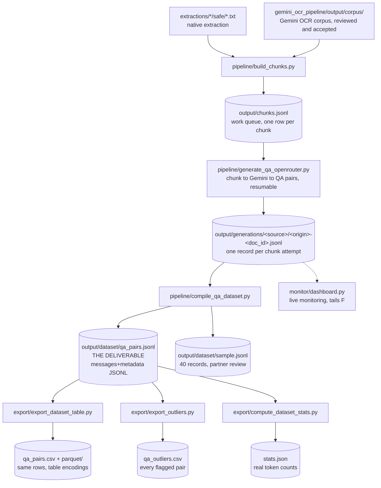

# QA-pair generation pipeline

Turns the clean Bahdini text corpus into instruction-tuning QA pairs for the
partner's Gemma 4 31B IT LoRA fine-tune, in the JSONL schema confirmed over
email (a `messages` list plus a `metadata` object). Mirrors the shape of
[gemini_ocr_pipeline/](../gemini_ocr_pipeline/): versioned prompt/config,
JSONL work queue, resumable per-document generation records, a compile step.

[gemma_tokenizer.py](gemma_tokenizer.py) is shared by the chunking and
compile stages: it loads the real `google/gemma-4-31B-it` tokenizer so every
token count in this pipeline (chunk sizes, final record lengths) is the
actual number of tokens Gemma will see, not a character-based guess. See
"The chunk queue" below for why that turned out to matter.

## Stages



Everything under `export/` reads the **deliverable**, not the generation
records, so its outputs correspond to `qa_pairs.jsonl` row for row.
`monitor/dashboard.py` (dashed) is a read-only observer of the generation
records and is not on the path to the dataset.

## Layout

```text
qa_generation/
  qa_config.py          shared config: prompt, pricing, paths, thresholds
  gemma_tokenizer.py    real google/gemma-4-31B-it token counts
  pipeline/             the build path, in order
    build_chunks.py         corpus -> output/chunks.jsonl
    generate_qa_openrouter.py   chunks -> output/generations/ (resumable)
    compile_qa_dataset.py       generations -> output/dataset/qa_pairs.jsonl
  export/               derived artifacts, all read the deliverable
    export_dataset_table.py     -> qa_pairs.csv, parquet/ (1:1, --verify)
    export_outliers.py          -> qa_outliers.csv (8 quality flags)
    compute_dataset_stats.py    -> stats.json (token counts, distributions)
    export_qa_csv.py            -> review sheet from the raw generations
  monitor/
    dashboard.py            live web dashboard, http://127.0.0.1:8765
    run_overnight_start.sh  detached unattended run (entry point)
    run_overnight.sh        the supervised loop it launches
  notebooks/            investigations
  assets/               self-hosted webfont for the dashboard
  output/               all generated data (gitignored)
```

`qa_config.py` and `gemma_tokenizer.py` stay at the top level because every
subdirectory imports them; the scripts add the parent to `sys.path`
themselves, so each stays runnable directly from anywhere
(`python3 qa_generation/export/export_outliers.py`) rather than only from
its own directory.

## The chunk queue

```bash
python3 qa_generation/pipeline/build_chunks.py
```

Source pool, by design (see
[discover_safe_docs](pipeline/build_chunks.py#L129-L151) and
[discover_ocr_docs](pipeline/build_chunks.py#L152-L173)), both included
unconditionally:

- `extractions/<source>/safe/*.txt`: native PDF text extraction, classified
  `safe` by `scripts/extract_pipeline.py`.
- `gemini_ocr_pipeline/output/corpus/`: rows with `classification ==
  "kurdish"`. This corpus has been reviewed and accepted (see
  [gemini_ocr_pipeline/README.md](../gemini_ocr_pipeline/README.md) and
  [docs/DOCUMENT_AI_OCR_GUIDE.md](../docs/DOCUMENT_AI_OCR_GUIDE.md)'s Stage D).

Chunking is paragraph-aware: [split_paragraphs](pipeline/build_chunks.py#L37-L46)
splits on the extraction pipeline's page-break `\f` markers, then blank
lines. [chunk_text](pipeline/build_chunks.py#L87-L128) then greedily packs paragraphs
up to [qa_config.TARGET_CHUNK_TOKENS](qa_config.py#L50-L63) (900, cap 1050,
floor 120), and [hard_split](pipeline/build_chunks.py#L59-L86) with
[token_hard_cut](pipeline/build_chunks.py#L47-L58) handle the rare oversized
paragraph. Sized so the *prompt* side of a QA record (system + question +
context) lands near the partner's ~1,000-token mean; see "Confirmed with the
partner" below for why the answer isn't part of that budget.

**Token counts are real, not estimated.** [gemma_tokenizer.py](gemma_tokenizer.py)
loads the actual `google/gemma-4-31B-it` tokenizer (already cached locally,
no model weights needed, just the tokenizer files) and every
chunk/paragraph/sentence is tokenized for real while packing, via
[count_tokens_batch](gemma_tokenizer.py#L66-L74) so a full run over the
corpus takes a few minutes (batched per document, see
[build_chunks.py main()](pipeline/build_chunks.py#L174-L260)). This replaced an
earlier char-based estimate ([qa_config.CHARS_PER_TOKEN](qa_config.py#L24-L49))
that assumed ~3.2 chars/token from a generic words/chars rule of thumb;
measured against the real tokenizer, Bahdini Arabic-script text actually
runs **~1.6 chars/token**, roughly twice as dense as that guess assumed.
`CHARS_PER_TOKEN` now holds that measured value and is used only as a
fallback if the real tokenizer cannot be loaded (offline, transformers
missing, gated repo not accepted); every function in `gemma_tokenizer.py`
degrades to it transparently, with a one-time warning, so the pipeline still
runs either way.

## Text-quality gate: legacy-font corruption

Chunking alone doesn't verify a document is actually meaningful text --
that was inherited from `extract_pipeline.py`'s document-level classifier,
and turned out not to hold for a large slice of the `safe_extraction` pool.
Random inspection of real chunks found documents like
`telegram_pertok_badini/چارینەیێن+بابا+طاهری.pdf` producing pure
character soup:

```text
ل ل ل ل / م & م & م & م & / S* S* S* S*
```

The manifest for that document shows `presentation_form_ratio: 0.078` and
plausible Kurdish-letter counts -- `extract_pipeline.py`'s corruption check
(>20% Unicode presentation forms) doesn't catch this class of problem at
all, because it's a legacy Kurdish font substituting the *wrong* Unicode
characters entirely, not presentation-form variants. The letter-frequency
statistics still look like real Kurdish; the character sequence doesn't
spell real words.

What actually separates it cleanly: the real Gemma tokenizer's chars/token
on a document's own chunks. The already-reviewed `ocr_corpus` pool (verified
clean by inspection, since Gemini transcribes from the rendered page image
rather than trusting the PDF's font) sits overwhelmingly at 1.9-2.2
chars/token; the corrupted `safe_extraction` documents sit at 1.0-1.5,
matching known garbled examples measured directly (1.18, 1.46) against
known clean ones (1.94). A per-chunk check on this was tried first and
rejected: one genuinely garbled document had individual chunks ranging from
0.12 to 0.52 purely from line-wrapping noise, so a per-chunk cutoff would
have let a lot of it through. The per-document **median** across a
document's own chunks is what actually separates cleanly, so
[qa_config.MIN_DOC_CHARS_PER_TOKEN](qa_config.py#L65-L81) (1.5) gates whole
documents in [build_chunks.py main()](pipeline/build_chunks.py#L209-L215), reusing
the token counts already computed for chunk sizing -- no extra tokenizer
calls.

Current run over both source pools, gate applied: 5,370 documents seen,
**369 skipped as likely corrupted** (almost all `safe_extraction` -- see the
per-source breakdown in `output/chunks_report.md`), producing **254,872
chunks (~189.1M real tokens)** from the survivors, split `ocr_corpus`
166,169 / `safe_extraction` 88,703.

**A second, separate bug turned up while verifying this fix:** `document_id`
is intentionally the same across both pools for the same underlying file
(`qa_config.doc_id` and `gemini_ocr_pipeline`'s `ocr_config.doc_id` use the
same hash on purpose, "so ids line up across pipelines"). That's fine on its
own, but 626 documents genuinely exist in *both* pools (the OCR pipeline
re-transcribes some "safe"-sources for consistency, per its own README), and
`chunk_id` used to be built from `document_id` alone -- so for those 626
documents, a `safe_extraction` chunk and an `ocr_corpus` chunk could end up
with the identical `chunk_id`. That would have silently corrupted
`pipeline/compile_qa_dataset.py`'s chunk-text lookup (a plain `dict` keyed by
`chunk_id`) and `pipeline/generate_qa_openrouter.py`'s resumability tracking (both
origins' generation attempts landing in the same per-document file). Found
by checking chunk_ids for collisions after the quality-gate rebuild: **41,457
colliding ids across 82,914 chunks, 32.5% of the whole queue.** Fixed by
including `origin` in both the chunk_id (`pipeline/build_chunks.py` line 219) and the
per-document generation file name (`output/generations/<source>/<origin>-<document_id>.jsonl`,
`pipeline/generate_qa_openrouter.py`); verified zero collisions in the current
254,872-chunk file.

## A third corruption class: stray control/PUA characters (fixed)

`MIN_DOC_CHARS_PER_TOKEN` (above) catches wholesale character-soup
corruption, but there's a second, distinct failure mode from the same root
cause that it does not catch: individual stray non-printable characters
scattered inside otherwise-clean chunks. Found by opening
`output/chunks.jsonl` in a pager and noticing a boxed control-character
glyph mixed into real Bahdini text; investigated in
[`notebooks/investigate_chunk_control_chars.ipynb`](notebooks/investigate_chunk_control_chars.ipynb)
(run with the `ai` conda kernel — has pandas/matplotlib/jupyter; the base
env doesn't).

**Original scope** (measured against the pre-fix `output/chunks.jsonl`):
374 of ~4,359 documents (3.93% of 254,872 chunks) carried at least one
genuine non-printable character. Three different mechanisms turned up,
across two rounds of investigation:

- **`Cc` cp1252 mojibake** (39 documents): PDF fonts using Windows'
  `WinAnsiEncoding` (cp1252) — curly quotes, em-dashes — decoded without
  translation, so bytes `0x80`-`0x9F` survive as raw C1 control codes
  instead of the character they were meant to be. Deterministically
  recoverable via `bytes([n]).decode("cp1252")`.
- **`Co` Private Use Area glyphs** (344 documents): custom/symbol/legacy
  Kurdish fonts with no (or a broken) `ToUnicode` CMap in the PDF — the
  same underlying "font glyph doesn't map to correct Unicode" problem
  behind the character-soup case above, just a different symptom. Of these,
  315 documents only showed PUA as standalone decoration (safe to strip);
  29 showed it mid-word, between two Arabic-script letters — i.e. an
  actual letter got silently replaced, the same class of bug
  `MIN_DOC_CHARS_PER_TOKEN` was built to catch, just invisible to that
  particular check.
- **Raw C0 control codes** (found *after* the first fix pass, verifying the
  rebuilt corpus turned up a residual 307 chunks / 27 documents the fix
  above didn't touch): the same font-substitution failure landing in the
  `0x00`-`0x1F` range instead — e.g. `رئی\x19\x19\x19\x19س` (repeated `0x19`
  clusters sitting mid-word). No cp1252-style recovery table applies to this
  range; unlike decorative PUA, a C0 control code has no legitimate
  standalone use in body text at all, so any occurrence is treated as a
  corruption signal, never silently stripped.

**The through-line, and the one rule that matters for any future case like
this**: never blanket-strip an unrecognized character class. `Co`/PUA had a
genuine decorative-use majority (bullets) alongside real letter
substitution — collapsing that distinction would have silently deleted real
words in the 29 mid-word documents.

**Why the existing gate misses this**: affected chunks' chars/token ratio
(mean 1.84) sits only slightly below unaffected chunks (mean 2.02), nowhere
near the 1.5 cutoff — a handful of stray characters gets averaged out by an
otherwise-normal ~900-token chunk. `Cf`-category characters (`U+06DD`
Arabic end-of-ayah, `U+200E`/`U+200F` bidi marks, `U+200D` ZWJ) look
superficially similar under a naive "non-printable" scan but are legitimate
Bahdini/Arabic-script content, not corruption — don't include `Cf` in any
future corruption check built from this.

**Root cause, confirmed**: predates this pipeline entirely. The corrupted
bytes are already present in `extractions/facebook/safe/*.txt` (the output
of `scripts/extract_pipeline.py`'s `extract_pdf()`, from an earlier
extraction run) — `pipeline/build_chunks.py` and `pipeline/generate_qa_openrouter.py` never
touch byte-level encoding, only text/whitespace. `extract_pipeline.py`'s
`clean_text()` runs NFKC + KLPT Kurdish normalization and nothing else; it
has no handling for either corruption mechanism above. Confirmed by origin:
11.66% of `safe_extraction`-origin chunks affected vs. 0.36% of
`ocr_corpus`-origin chunks — almost exclusive to the native PDF text layer,
since Gemini OCR reads the rendered page image and never depends on the
PDF's internal font encoding.

**Status: fixed.** `clean_text()`, `text_stats()`, and `classification()` in
`scripts/extract_pipeline.py` now handle all three mechanisms:
`recover_cp1252_controls()` deterministically repairs `Cc` mojibake;
`handle_pua_chars()` strips decorative `Co` but leaves mid-word `Co` in
place and flags it; `count_stray_c0_controls()` flags any residual C0
control code. Both flags route the whole document to `ocr_needed` via
`classification()`, exactly like the existing `MIN_DOC_CHARS_PER_TOKEN`
gate — this is now a permanent, first-class check, not a one-off patch, so
any future extraction run (a new crawl, a re-run) gets it automatically.

Applied to the already-extracted corpus with
[`scripts/backfill_char_corruption_fix.py`](../scripts/backfill_char_corruption_fix.py)
— rewrites `extractions/*/safe/*.txt` in place using the fixed
`clean_text()`, refreshes each manifest record's stats, then calls
`classify_source()` to physically move any newly-flagged document from
`safe/` to `ocr_needed/`. Entirely local (re-processes already-extracted
text, no PDF re-parsing, no network/API calls) — **$0**.

**Before/after** (`output/chunks_report.md`, two backfill passes — cp1252 +
PUA first, then the C0 extension after verification turned up the
residual):

| | before | after |
|---|---|---|
| documents seen | 5,370 | 5,219 (151 reclassified to `ocr_needed`) |
| docs skipped as garbled (`MIN_DOC_CHARS_PER_TOKEN`) | 369 | 264 (105 *fewer* — stray characters were dragging otherwise-clean documents under the 1.5 cutoff; the fix rescued them) |
| chunks written | 254,872 | 246,515 (-3.3%) |
| context tokens | 189,053,622 | 183,119,057 (-3.1%) |
| chunks with real corruption (`Cc`/`Co`/`Cs`, `safe_extraction` origin) | 10,026 (374 docs) | **0** |
| chunks with real corruption (any origin) | 10,026 | 8, all in `ocr_corpus` — a separate, untouched pipeline (Gemini OCR doesn't depend on PDF font encoding, so this fix doesn't apply there; a different, much smaller, unrelated residual) |

**Impact on the already-recorded pilot generation**: of 255 real chunk
attempts recorded before the fix (`output/generations/`), 245 (96%) still
match a `chunk_id` in the rebuilt `chunks.jsonl` and stay valid; 10 (4%)
were orphaned by chunk-boundary shifts and will be silently regenerated as
new pending chunks on the next `pipeline/generate_qa_openrouter.py` run — a few
cents of redundant spend, not data loss.

## Generation

```bash
python3 qa_generation/pipeline/generate_qa_openrouter.py --dry-run              # how many chunks are pending
python3 qa_generation/pipeline/generate_qa_openrouter.py --max-chunks 20        # a quick sample first
python3 qa_generation/pipeline/generate_qa_openrouter.py --budget-usd 25 --concurrency 16
```

[run()](pipeline/generate_qa_openrouter.py#L193-L245) calls Gemini through OpenRouter
(reuses `OPENROUTER_API_KEY` from `.env`, same as
`gemini_ocr_pipeline/run_ocr_openrouter.py`), one request per chunk, and
appends one record per attempt to
`output/generations/<source>/<origin>-<document_id>.jsonl`.

### Exactly what is sent to the model

**There is no system message.** The entire instruction block below goes to
OpenRouter as a *single* `{"role": "user"}` message; the `messages` array
has exactly one element. This is worth stating plainly because
`qa_config.py` also defines `QA_SYSTEM_PROMPT`, and the two are unrelated:

| constant | who ever sees it |
|---|---|
| `QA_GENERATION_PROMPT_TEMPLATE` | **Gemini, at generation time.** The prompt below. Never appears in the delivered dataset. |
| `QA_SYSTEM_PROMPT` / `QA_SYSTEM_PROMPT_NO_CONTEXT` | **Gemma, at fine-tune time.** Written into the `system` slot of the finished training records by `pipeline/compile_qa_dataset.py`. Never sent to Gemini. |

Confusing these is an easy way to "fix the prompt" and change nothing about
what is generated, or vice versa.

The generation prompt is
[qa_config.QA_GENERATION_PROMPT_TEMPLATE](qa_config.py), currently version
`v3` (recorded on every output record as `prompt_version`, so the corpus
stays attributable if it changes again). Rendered with `n_pairs=4`, verbatim
— reproduce it any time with
`python3 -c "import qa_config as c; print(c.build_qa_prompt('<CHUNK TEXT>'))"`:

```text
You are building instruction-tuning data for a 100% pure Bahdini (Badini) Kurdish language model. Bahdini is spoken by people in Dohuk city and governorate.

Below is one excerpt ("the context") from a Bahdini text. Write 4 question-answer pairs a person could ask about this excerpt, as if using it for reading comprehension / instruction fine-tuning.

Rules:
- CRITICAL DIALECT RULE: Both the question and the answer MUST be written in 100% pure Bahdini Kurdish (Arabic script) exactly as spoken in Dohuk. Do NOT mix in any Sorani words, phrases, or grammar. Do NOT use general Kurmanji vocabulary or Latin script. You must ensure the dialect is strictly pure Bahdini.
- The answer must be grounded in the context: prefer extractive answers quoting or closely paraphrasing the text; reasonable inference/synthesis is fine for explanatory or summarization questions, but never introduce facts that are not supported by the context.
- Do not ask about the excerpt's formatting, page numbers, or the fact that it is an excerpt.
- Vary the question_type across the set; choose only from: factual, explanatory, summarization, definitional, inferential.
- If the context is too short, garbled, or content-free to support 4 distinct, well-grounded questions, return fewer pairs (an empty list is fine) rather than inventing filler.
- If answering the question genuinely requires connecting multiple details in the context or drawing a conclusion beyond a single stated fact, also fill in "reasoning": a brief step-by-step justification, in pure Bahdini Kurdish, for how the answer follows from the context. If the question is directly answerable by quoting or restating one explicit fact, set "reasoning" to null; do not pad it with filler.

Output strict JSON only: a list of objects, no markdown fences, no commentary before or after. Each object must have exactly these keys:
  "question": string
  "answer": string
  "question_type": one of ['factual', 'explanatory', 'summarization', 'definitional', 'inferential']
  "reasoning": string or null (see rule above)

Context:
"""
<CHUNK TEXT>
"""
```

Two things to know before editing it:

- The `one of ['factual', ...]` line renders a Python list repr, quotes and
  all, because `build_qa_prompt` interpolates `QUESTION_TYPES` directly
  while the bullet above it uses a `', '.join(...)`. Cosmetically sloppy and
  harmless in practice (the model complies), but **do not tidy it
  mid-corpus** — any edit to this template is a new `QA_PROMPT_VERSION`, and
  bumping it part-way through leaves the delivered dataset generated under
  two different instructions.
- The dialect rule got its shouty phrasing in `v3` on purpose; see the
  version history below.

### Request parameters

Set in [call_openrouter](pipeline/generate_qa_openrouter.py#L102-L147):

| field | value | why |
|---|---|---|
| `model` | `--model`, default [`OPENROUTER_MODEL`](qa_config.py) = `google/gemini-3.1-flash-lite` | see the pricing section below |
| `temperature` | `0.7` | four pairs are requested in one call, so some sampling diversity is wanted; low temperature made the four read as restatements of each other |
| `max_tokens` | `MAX_OUTPUT_TOKENS` = 2048 | four Bahdini pairs with reasoning run ~600 output tokens, so this is headroom, not a target |
| `messages` | one `user` message, the prompt above | no system role, no JSON mode, no `response_format` — the format is enforced by the prompt and validated after the fact |
| timeout | 180 s per attempt | |

`google/gemini-3.1-flash-lite` was chosen over the `pro` tier after a pilot:
40 chunks at 3 pairs and 40 at 4 pairs, flash-lite returned the full
requested count on 39/40 either way, and the fourth pair read as a genuinely
distinct question rather than filler — so
[`PAIRS_PER_CHUNK`](qa_config.py) is **4** and the cheaper tier does the job.

### Failure handling, and what counts as "done"

[parse_qa_response](pipeline/generate_qa_openrouter.py#L68-L99) strips any markdown
fence, parses the JSON, and keeps only entries that have a non-empty
`question`, a non-empty `answer`, and a `question_type` **in
`QUESTION_TYPES`** — an individual malformed pair is dropped, it does not
fail the chunk. Each record lands with one of four statuses:

| status | meaning | retried on the next run? |
|---|---|---|
| `ok` | at least one valid pair | no |
| `empty` | the model returned `[]` — the intended answer for a garbled or content-free chunk | no |
| `parse_error` | response was not a JSON list, or every entry was malformed | **yes** |
| `error` | HTTP/network failure after all retries | **yes** |

That last column is the whole resume contract, and it is decided by
[done_chunk_ids](pipeline/generate_qa_openrouter.py#L74-L86), which admits only `ok`
and `empty` to the done set. So re-running the script is always safe and
always makes progress: finished work is skipped, failures are re-attempted,
and a chunk that keeps failing simply accumulates records rather than
blocking the queue. Ctrl-C is safe at any point — every completed chunk is
already flushed to disk.

Transport-level retries live in
[call_openrouter](pipeline/generate_qa_openrouter.py#L102-L147): `RETRY_ATTEMPTS = 5`
with exponential backoff plus jitter (`2·2^n + rand(0,1)` seconds) on 429
and 5xx. **402 and 403 are treated as terminal**, not retried — they mean
credit exhausted or the key was rejected, and they set `state["stop"]`,
which drains in-flight requests and ends the run rather than burning five
backoff cycles per chunk against a dead key.

### CLI reference

| flag | default | notes |
|---|---|---|
| `--source` | all | repeatable, e.g. `--source facebook` |
| `--origin` | all | `safe_extraction` or `ocr_corpus`, repeatable |
| `--max-chunks` | all pending | for producing a review sample |
| `--budget-usd` | none | stops dispatching once *this run's* estimated cost hits it — see the pricing section; it is per-run, not lifetime |
| `--concurrency` | 8 | requests in flight |
| `--batch-size` | 16 | chunks per `gather()`. This is a **barrier**: the next batch does not start until the slowest request in the current one returns, so keep it comfortably above `--concurrency` or the semaphore starves on stragglers |
| `--pairs-per-chunk` | 4 | |
| `--model` | `google/gemini-3.1-flash-lite` | add any new slug to `OPENROUTER_PRICING` first |
| `--no-shuffle` | off | by default the queue is shuffled with a **fixed seed** (`random.Random(0)`), so a `--max-chunks`/`--budget-usd` cap yields a spread across all sources and documents instead of exhausting one source alphabetically. Fixed rather than random so the order is identical across resumes |
| `--dry-run` | off | counts pending chunks, calls nothing |

### Prompt version history

| version | change |
|---|---|
| `v1` | initial: 3 pairs, context target 700 tokens, no `reasoning` field |
| `v2` | added the optional `reasoning` field (only when the question genuinely needs multi-step justification), plus `CONTEXT_RATIO` and the 900-token context target, after the partner confirmed the token budget covers the prompt side only |
| `v3` | **current.** Rewrote the dialect rule after review found Sorani and general-Kurmanji vocabulary leaking in. "Bahdini is the Kurmanji dialect written in Arabic script, spoken in the Duhok/Badinan region" became "spoken by people in Dohuk city and governorate", and the soft "must be written in Bahdini Kurdish … (do not switch to Sorani …)" became the explicit `CRITICAL DIALECT RULE` above, naming Sorani, general Kurmanji, and Latin script as separate prohibitions. Reasoning must also be pure Bahdini |

All 41,467 records currently on disk are `v3`.

### Pricing is per model, and getting it wrong is not just cosmetic

`estimate_cost_usd()` takes the model slug and looks the rate up in
`OPENROUTER_PRICING`. It used to hold a single hardcoded pair of
pro-preview constants applied to every run regardless of `--model`. On a
flash-lite run that overstated cost by **3.75x**: a live run reported
`$61.07` while OpenRouter's own dashboard showed `$16` for the same
traffic.

The reason this matters beyond the display: **`--budget-usd` is evaluated
against this estimate**, so an inflated rate makes a run stop far short of
its real budget. The first full-corpus attempt carried `--budget-usd 350`
and would have self-halted at roughly 32% of the queue having actually
spent about $93, looking for all the world like a completed run.

When adding a model, add its row to `OPENROUTER_PRICING` and verify against
that model's OpenRouter page. An unknown slug deliberately falls back to
the most expensive known rate, so the failure mode is stopping early rather
than overspending.

**The corrected model has since been validated end to end against a whole
exhausted key.** Recomputing every record on disk from its stored token
counts gives **$50.04**; OpenRouter's own `/api/v1/key` endpoint reports
`usage: 50.0542` for the same key. That is a 0.03% error over 41,467 calls,
so the projections below can be treated as real numbers rather than
estimates. Extrapolated: about **$297 for the full 246,515-chunk corpus**.

Note that generation records written before this fix carry an inflated
`est_cost_usd`. Both `input_tokens` and `output_tokens` are stored
correctly, so the field is recomputable; `monitor/dashboard.py` recomputes rather
than trusting it. To check spend against the provider directly, without
waiting for the dashboard to index:

```bash
curl -s https://openrouter.ai/api/v1/key \
  -H "Authorization: Bearer $(grep '^OPENROUTER_API_KEY=' .env | cut -d= -f2-)"
```

## Run state: complete

The full corpus was generated over 2026-08-06 to 2026-08-10. Recomputed
from `output/generations/` (regenerate any time with the snippet at the end
of this section):

| | |
|---|---|
| chunks covered | **246,515 of 246,515 — 100%** |
| `ok` / `empty` / `parse_error` / `error` | 238,315 / 8,209 / 1,687 / 32 |
| QA pairs produced | **952,822** (4.00 per `ok` chunk) |
| pairs carrying `reasoning` | 508,070 (53.3%) |
| total spend | **$301.41** across both keys |

`empty` (3.3%) is the model correctly declining to invent pairs for a
garbled or content-free chunk — the intended behaviour, not a failure.
`parse_error` + `error` is 1,719 chunks, **0.7%**, that never yielded pairs.

Two notes on how the run ended. The overnight driver stopped at its
`MAX_ATTEMPTS` cap of 40 with `pending = 1`: a single chunk fails to parse
on every retry, so the loop could never reach zero. One chunk in 246,515 is
not worth chasing, but that is why the log ends on the cap rather than on
`queue empty`. Sustained throughput was ~450 chunks/min at `--concurrency
32`, and the resume/retry path was exercised repeatedly across the 40
attempts without producing duplicate pairs — `done_chunk_ids` held.

To regenerate anything (a re-run is safe and idempotent; `ok`/`empty`
chunks are skipped):

```bash
cd qa_generation/pipeline
python3 generate_qa_openrouter.py --concurrency 32 --batch-size 128 --budget-usd 400
```

### Unattended / overnight runs

```bash
bash qa_generation/monitor/run_overnight_start.sh            # start, detached
bash qa_generation/monitor/run_overnight_start.sh --status   # check on it
bash qa_generation/monitor/run_overnight_start.sh --stop     # stop; progress is saved
```

[run_overnight_start.sh](monitor/run_overnight_start.sh) launches
[run_overnight.sh](monitor/run_overnight.sh) and the dashboard, and exists because a
plain backgrounded run does not survive the night. Three problems it solves,
each of which actually bit:

1. **Detachment.** A job started with `&` from a terminal or an agent
   session stays in that session's process group and is killed when the
   session tears down — a full run was lost this way with no error anywhere,
   just a dead process. The launcher forks, calls `os.setsid()`, and execs,
   so the driver ends up with `PPID 1` and its own process group. Verify
   with `ps -o pid,ppid,pgid -p $(cat qa_generation/output/overnight.pid)`;
   `PPID` must be 1. (macOS has no `setsid(1)`, hence the Python.)
2. **Sleep.** The driver runs under `caffeinate -ims` (no idle, disk, or
   system sleep). `--status` reports the real assertion state from `pmset`,
   not just whether the process exists. **Closing a laptop lid sleeps the
   machine regardless of caffeinate** — leave the lid open and stay on mains
   power, since `-s` only applies on AC.
3. **Restarts, without a budget hole.** The generator's `--budget-usd` is
   *per run*, so a naive restart loop resets the cap every iteration. The
   driver instead reads `limit_remaining` back from OpenRouter before each
   attempt and passes that (minus a $3 reserve) as the cap, so it tracks
   cumulative spend across restarts. The key's server-side limit is the hard
   backstop below that — 402 makes the generator stop cleanly.

The loop ends by itself when the generator reports `0 pending`, and is
bounded at `MAX_ATTEMPTS` (40) regardless. Tunables are environment
variables: `CONCURRENCY`, `BATCH_SIZE`, `MAX_ATTEMPTS`, `RESERVE_USD`,
`COOLDOWN_S`.

Logs land in `output/overnight_<timestamp>.log`, one line per attempt with
credit and cap, plus the generator's own per-chunk output.

One wrinkle if you audit the records by hand: **175 of them carry
`model: "gemini-3.1-pro-self-antigravity"`**, from a one-off manual
experiment on 2026-07-30, not from this script. They have no
`input_tokens`/`output_tokens`, so they contribute $0 to every cost figure
above, and they are the only source of the two off-list `question_type`
values in the corpus (`descriptive` ×3, `comparative` ×1) — this script's
parser would have rejected those. They are otherwise valid Bahdini pairs and
are left in place; `pipeline/compile_qa_dataset.py` does not re-validate
`question_type`, so filter on it there if the partner wants strictly the
five agreed types.

```bash
# regenerate the table above
cd qa_generation && python3 - <<'PY'
import glob, json, collections, qa_config as cfg
tot=collections.Counter(); pairs=cost=tin=tout=reas=0
for p in glob.glob(str(cfg.GENERATIONS_DIR/"*"/"*.jsonl")):
    for line in open(p, encoding="utf-8"):
        if not line.strip(): continue
        r=json.loads(line); tot[r.get("status","error")]+=1
        i,o=r.get("input_tokens") or 0, r.get("output_tokens") or 0
        tin+=i; tout+=o; cost+=cfg.estimate_cost_usd(i,o,r.get("model"))
        for q in r.get("qa_pairs") or []:
            pairs+=1; reas+=bool(q.get("reasoning"))
n=sum(tot.values())
print(dict(tot), f"{n:,} chunks = {n/246515:.1%}", f"{pairs:,} pairs",
      f"{reas:,} with reasoning", f"${cost:.2f}", f"proj ${cost/n*246515:.0f}")
PY
```

## Live monitoring

```bash
python3 qa_generation/monitor/dashboard.py     # http://127.0.0.1:8765
```

An interactive local dashboard for watching a long run: streaming feed of
the actual generated Bahdini QA pairs with each new arrival animated in,
throughput chart, per-source and per-question-type distributions, corrected
running cost, and a projected full-run total. Filter by source or question
type, search question and answer text, pause the feed without pausing the
counters, toggle a table view, toggle light and dark.

Two things keep it cheap enough to leave open for a whole multi-hour run:
the server tails `generations/*.jsonl` by byte offset so it only reads
newly-appended bytes, and the browser polls `/api/delta?since=<seq>` which
returns only records newer than the client's last sequence number. Measured
on a live run that is 931 KB for a cold load versus about 2 KB per delta,
which is what makes a 350 ms refresh interval reasonable. Stdlib only,
binds `127.0.0.1`, about 26 MB resident.

Bahdini text in the feed is set in **IBM Plex Sans Arabic**, self-hosted
from [assets/](assets/) and served at `/fonts/` by the same process (no CDN,
so it renders the same with no network). The default `ui-sans-serif` stack
resolved Arabic script to whatever generic face the OS picked — Geeza Pro on
macOS — which matters here specifically, because judging dialect purity
means reading closely and the Kurdish-specific letters (ڕ ڵ ێ ڤ ۆ ە) are
exactly where a generic face gets ambiguous. Plex Arabic is a real text
face, is freely redistributable, and its shipped subset was checked
codepoint by codepoint against those letters rather than assumed. Adobe
Arabic and Calibri were both considered and rejected: proprietary, and not
installed on this machine, so naming either in the stack would have silently
fallen straight back through to the generic default it was meant to replace.
Arabic-script blocks are also set larger and looser than the surrounding UI
text, since the script has a smaller x-height at the same nominal size and
stacks marks above and below the baseline.

To swap the face, drop a `.woff2` in `assets/`, add its filename to
`FONT_FILES` in [dashboard.py](monitor/dashboard.py), and point the `@font-face`
`src` at it. Font requests are served by exact-name allowlist, not by
joining the request path onto a directory, so `/fonts/../../.env` 404s.

## Reviewing quality in a spreadsheet

```bash
python3 qa_generation/export/export_qa_csv.py
python3 qa_generation/export/export_qa_csv.py --per-cell 100 --context-chars 1200
```

The dashboard is for watching a run; [export_qa_csv.py](export/export_qa_csv.py) is
for sitting down with the output. It flattens every generated pair to one
row **next to the context it was grounded in**, so a Bahdini speaker can
judge dialect and grounding side by side without reading JSON. Two files
land in `output/dataset/`:

| file | rows | size | what it is |
|---|---|---|---|
| `qa_review_sample.csv` | 2,404 | 7.7 MB | `--per-cell` (default 60) rows from each `(source, question_type)` cell. **Start here** |
| `qa_review_all.csv` | 952,822 | 3.05 GB | every pair. Fine for pandas, hopeless in Excel |

The sample is stratified rather than a head or a flat random draw for a
concrete reason: two telegram sources are ~70% of all pairs, so any
unstratified sample is mostly those two and says nothing about `spirez` or
`sh2_unicodefixed_bahdini`. Cells are filled with a fixed seed, so the same
sample comes back on a re-run.

Columns are `question`, `answer`, `reasoning`, `context`, and the provenance
needed to chase anything suspicious back to its record (`source`, `origin`,
`document_id`, `chunk_id`, `pair_index`, `model`, `prompt_version`, `ts`),
plus three cheap review aids: `has_reasoning`, `question_chars`/
`answer_chars`, and `latin_chars_in_answer`. That last one is the useful
one — the prompt forbids Latin script outright, so a non-zero value is an
objective, checkable violation rather than a matter of taste. Sort
descending on it and the worst offenders surface immediately. **1.43% of
answers (13,593) contain at least one Latin letter** — measured at 1.43% on
the 16.8%-complete corpus too, so the rate is stable and not a late-run
artefact; spot-checking whether
those are genuine leakage or incidental (a Latin-script proper noun, a
citation) is a good first review task.

Written with a UTF-8 BOM (`encoding="utf-8-sig"`), which is load-bearing:
Excel assumes the system legacy codepage for a BOM-less UTF-8 CSV and turns
every Arabic-script cell into mojibake. Set the text columns to a Kurdish
font once open — Excel's default will not be one.

There is no dialect-purity column here on purpose. Sorani-vs-Bahdini is not
separable by a character-class check, and a plausible-looking automated
score shipped as a column would be worse than none: it would get trusted.
That judgment is the reviewer's, which is what this file is for.

### Open finding: Sorani contexts in the source corpus

The first pass over `qa_review_sample.csv` turned up something the pipeline
does not currently handle, and it is a corpus problem, not a generation
problem. Some source **contexts are Sorani, not Bahdini**. An unambiguous
example, `facebook`, chunk context reading
`قەڵەمە پارکەرەکەی باوکم … بۆ وا بە کوڵ دەگریت؟` — Sorani orthography
throughout (`ەکەی` definite suffix, `دەگریت` verb form).

The generator behaves correctly when this happens: it obeys the dialect rule
and writes the question and answer in Bahdini anyway. **The problem is at
compile time.** `pipeline/compile_qa_dataset.py` puts the raw chunk text into the
user message for the ~70% `with_context` share, so a Sorani context ends up
inside the training prompt of an otherwise-Bahdini record.

Scale, screened with a crude marker-frequency heuristic over the 2,404-row
sample (Sorani `ەکان`/`ەکەی`/`لە`/`دەکات` vs Kurmanji `ژ`/`دگەل`/`دڤێت`/
`ئەڤ`), counted per unique chunk:

| source | bahdini | mixed | sorani |
|---|---|---|---|
| facebook | 132 | 54 | **95** |
| zcks | 176 | 51 | **55** |
| pertokenbadini | 266 | 21 | 5 |
| spirez | 241 | 22 | 6 |
| sh2_unicodefixed_bahdini | 231 | 20 | 2 |
| telegram_badini_book | 267 | 28 | 4 |
| telegram_jihana_pertuken_pdf | 276 | 18 | 5 |
| telegram_pertok_badini | 273 | 12 | 4 |

Read this as a direction, not a measurement — the heuristic has no validated
threshold, several markers (`بۆ`, `ئەم`) genuinely occur in both dialects,
and "mixed" is as likely to mean "the heuristic is unsure" as "the text is
mixed". What survives the caveats is the shape: contamination is
**concentrated in `facebook` and `zcks`** (roughly a third and a fifth of
their chunks) and near-absent in the five telegram/pertok book sources. That
is consistent with their provenance — social posts and a mixed-dialect site
versus curated Bahdini books.

Not acted on yet, and deliberately not blocking the current run: the
generated pairs themselves are fine, so nothing being spent now is wasted,
and this is fixable after the fact at the compile step. Worth deciding
before delivery:

1. Have a Bahdini speaker check a stratified `facebook`/`zcks` slice of
   `qa_review_sample.csv` and confirm the heuristic is pointing at real
   Sorani, then calibrate a threshold against those labels.
2. If confirmed, the cheap fix is at compile time — force the affected pairs
   to `no_context` rather than dropping them, which keeps the Bahdini Q/A
   and only discards the Sorani prompt text.
3. The thorough fix is a dialect gate in `pipeline/build_chunks.py`, alongside
   `MIN_DOC_CHARS_PER_TOKEN`, applied per document like that one. Same
   lesson as the corruption gates above: per-document, because dialect is a
   property of the document, and a per-chunk cutoff would shred documents
   on line-wrapping noise.

## Compiling the dataset

```bash
python3 qa_generation/pipeline/compile_qa_dataset.py --sample-size 20
```

**Current output** (full corpus, ~40 s end to end):

| file | size | contents |
|---|---|---|
| `output/dataset/qa_pairs.jsonl` | **2.55 GB** | 952,801 records — the deliverable |
| `output/dataset/sample.jsonl` | 44 KB | 40 records, every `(question_type, context_mode)` combination |
| `output/dataset/report.md` | — | counts and the prompt-length check |

952,801 rather than the 952,822 pairs on record: 21 pairs reference 6
chunk_ids that no longer exist in `chunks.jsonl`, orphaned when the corpus
was rebuilt after the character-corruption fix. Measured split is 70.0%
`with_context` / 30.0% `no_context`, matching `CONTEXT_RATIO` exactly, and
mean prompt length is **584 tokens** against the partner's ~1,000 mean, with
0.02% over the 1,300-token flag.

### It streams, and it has to

Both this and `export/export_qa_csv.py` were originally written against the pilot's
~1,700 pairs and held everything in memory: all of `chunks.jsonl` as a dict
(~1.1 GB) plus every finished record in a list (~2.5 GB). At the full
corpus that is several GB of live objects, which does not fit alongside a
16 GB machine's working set — the first attempt to run the CSV exporter at
full scale had to be killed before it started swapping. Both now:

- index `chunks.jsonl` by **byte offset** (~40 MB) and `seek()` per record,
  the same approach `pipeline/generate_qa_openrouter.py` already used on that file;
- write each record as it is built rather than collecting it;
- keep only bounded per-cell buffers for the samples — `export/export_qa_csv.py`
  uses reservoir sampling, since it cannot hold the population to draw from.

Result: 952k records in 37 s at flat memory, versus not completing at all.

**The prompt-length check is sampled, and says so.** `count_prompt_tokens`
renders the Gemma chat template per record; doing that for ~950k records is
~2M template renders and takes hours, for a QC statistic a sample estimates
fine. `--token-check-sample` (default 25,000) controls it, `0` tokenizes
everything, and `report.md` states which coverage produced the number. This
does not touch the deliverable — every record is still written.

[build_record](pipeline/compile_qa_dataset.py#L76-L103) wraps every generated
`{question, answer, question_type, reasoning}` pair with its source chunk's
text into the agreed schema. A `CONTEXT_RATIO` share (default 0.7) of
records get a `Context: ...` block in the user message; the rest are a bare
question, per the partner's two serving modes (retrieval vs. not):

```json
{
  "messages": [
    {"role": "system", "content": "Answer the question in Bahdini Kurdish using the supplied context."},
    {"role": "user", "content": "Context: <chunk text>\n\nQuestion: <question>"},
    {"role": "assistant", "content": "<answer>", "reasoning": "<only present when the question needs it, else omitted>"}
  ],
  "metadata": {
    "document_id": "<source document id>",
    "chunk_id": "<source chunk id>",
    "source": "<source name, e.g. facebook, zcks, telegram_badini_book>",
    "question_type": "<factual, explanatory, summarization, definitional, inferential>",
    "context_mode": "<with_context, ~70%, or no_context, ~30%>"
  }
}
```

For a `no_context` record, the user message is just `"Question: <question>"`
and the system prompt switches to
[QA_SYSTEM_PROMPT_NO_CONTEXT](qa_config.py#L108-L113) (dropping "using the
supplied context", which would be wrong when there isn't one). The
`with_context`/`no_context` split is assigned per QA pair with a seeded RNG
(`CONTEXT_MODE_SEED = 42`), so it's reproducible across re-runs of the same
generation records rather than reshuffled every time.

**The `reasoning` key isn't a field we invented.** Gemma 4's own chat
template has a native thought channel, and its jinja source
(`~/.cache/huggingface/hub/models--google--gemma-4-31B-it/.../chat_template.jinja`)
reads `message.get('reasoning')` directly off the assistant message dict and
renders it into `<|channel>thought\n...\n<channel|>` ahead of the answer.
Verified directly:

```python
>>> tok.apply_chat_template([
...     {"role": "assistant", "content": "The final answer.", "reasoning": "Step by step reasoning."}
... ], tokenize=False)
'...<|turn>model\n<|channel>thought\nStep by step reasoning.\n<channel|>The final answer.<turn|>\n'
```

versus inlining a hand-rolled marker into `content` itself, which the
template does *not* specially handle (it just becomes literal text in the
answer) -- confirming the partner's instruction that reasoning has to live
in its own field, not inline in the content.

[main()](pipeline/compile_qa_dataset.py#L134-L222) writes `output/dataset/qa_pairs.jsonl`
(the full set), `sample.jsonl` (up to `--sample-size` records, built by
[build_sample](pipeline/compile_qa_dataset.py#L114-L131), which round-robins across
every `(question_type, context_mode)` combination actually generated so a
small sample still shows every type instead of whichever came first), and
`report.md` (counts per source/question_type/context_mode, how many records
carry a `reasoning` field, and how many exceed a 1,300-token flag threshold).
That check uses
[record_prompt_tokens](pipeline/compile_qa_dataset.py#L106-L111), which calls
[gemma_tokenizer.count_prompt_tokens](gemma_tokenizer.py#L88-L99): tokens for
system + question + context only, rendered exactly as Gemma would see them
before generating (`add_generation_prompt=True`) -- the answer is
deliberately excluded, per the confirmed budget below.

## The dataset as a table, and publishing it

```bash
python3 qa_generation/export/export_dataset_table.py --verify
```

[export_dataset_table.py](export/export_dataset_table.py) flattens
`output/dataset/qa_pairs.jsonl` to CSV and Parquet. It reads **the
deliverable itself**, not the generation records, which is the entire point:
`export/export_qa_csv.py` builds a review sheet of a deliberately different shape
(extra QC columns, no `context_mode`, and it includes pairs whose chunk text
went missing), so it carries 952,822 rows against the deliverable's 952,801
and shows raw chunks rather than the user message actually trained on. Using
it as "the dataset in CSV form" would be wrong on all three counts.

| output | size |
|---|---|
| `output/dataset/qa_pairs.csv` | 2.33 GB |
| `output/dataset/parquet/train-0000{0..3}-of-00004.parquet` | 0.35 GB total |

Columns are the JSONL content and nothing derived: `system`, `user`,
`assistant`, `reasoning`, `document_id`, `chunk_id`, `source`,
`question_type`, `context_mode`. `user` is kept whole rather than split into
question/context columns — context is ~90% of the bytes, so carrying it
twice would nearly double a multi-GB file, and the joined string is what the
model is trained on.

`--verify` reconstructs records from the written table and diffs them
against the source JSONL, streaming both rather than loading either:
currently `952,801 vs 952,801 MATCH, 0 mismatches`.

### Uploading to a private Hub dataset repo

Prefer Parquet: 7x smaller, typed, and read natively by the dataset viewer.
The shard names already follow the Hub convention, and
[hf_dataset_card.md](hf_dataset_card.md) carries matching YAML front matter
(`data_files: data/train-*.parquet`) plus a Known Issues section.

```bash
conda activate ai                       # the hf CLI lives in this env
hf auth login                           # write-scoped token
hf repo create bahdini-qa-pairs --repo-type dataset --private
hf upload <user>/bahdini-qa-pairs qa_generation/output/dataset/parquet data --repo-type dataset
hf upload <user>/bahdini-qa-pairs qa_generation/hf_dataset_card.md README.md --repo-type dataset
```

Note that HuggingFace has restricted the **dataset viewer on private repos**
to PRO/Enterprise accounts. Files and `load_dataset` work regardless; the
browsable table may not render on a free account until the repo is public.
Worth re-checking against current Hub docs rather than trusting this line.

## The outlier sheet

```bash
python3 qa_generation/export/export_outliers.py                      # default
python3 qa_generation/export/export_outliers.py --context-chars 0    # full context
```

[export_outliers.py](export/export_outliers.py) puts every anomaly found while
building this corpus into one reviewable CSV, `output/dataset/qa_outliers.csv`
(263 MB), one row per flagged pair. Rows are keyed by `row_index`, the
0-based line in `qa_pairs.jsonl`, so a decision made here maps back exactly:
`sed -n "$((row_index+1))p" qa_pairs.jsonl`.

Current counts — 103,357 rows flagged, **10.85%** of the dataset (a row can
carry several flags):

| flag | rows | |
|---|---|---|
| `sorani_answer` | 41,512 | heuristic; the answer reads as Sorani |
| `sorani_context` | 28,272 | heuristic; Sorani context inside a `with_context` prompt — the case that actually leaks into training |
| `duplicate_question` | 25,441 | question string repeats an earlier row; `duplicate_of_row` points at the first |
| `latin_in_answer` | 13,593 | objective violation of the prompt's Latin-script ban; `latin_sample` shows the substrings |
| `offpipeline_model` | 391 | from the 175-chunk one-off experiment |
| `long_prompt` | 27 | over the 1,300-token flag threshold |
| `offlist_question_type` | 4 | `descriptive` / `comparative` |
| `missing_context` | 0 | confirms the 21 orphaned pairs never entered the deliverable |

**The two Sorani rows are the weakest numbers in that table** and should be
read as "size of the queue to inspect", not "number of bad rows" — no
validated threshold, and markers like `بۆ`/`ئەم` occur in both dialects.
`sorani_score` and `bahdini_score` are exposed as columns precisely so the
cutoff can be re-judged in a spreadsheet. The honest next step is labelling a
few hundred by eye and calibrating against those labels. Highest-yield slice
to start on: `flag_sorani_context=1` filtered to `facebook` and `zcks`.

Two implementation notes. `long_prompt` requires tokenizing, so only records
long enough to plausibly exceed 1,300 tokens are measured (`>= 1900` chars —
chunks cap at 1,050 tokens and the document gate floors chars/token at 1.5,
so nothing shorter can reach it); `--max-tokenize` caps the work and the
script **says so in its output when the cap is hit**, since a silently
truncated flag is worse than a slow one. And `duplicate_question` hashes
questions with blake2b rather than comparing strings, keeping ~950k entries
in a dict instead of the questions themselves.

## The build report (PDF)

```bash
python3 qa_generation/export/make_report_figures.py   # 8 PNGs -> output/figures/
bash qa_generation/report/build.sh                    # two XeLaTeX passes -> PDF
```

[report/qa_generation_report.tex](report/qa_generation_report.tex) is the
single-source-of-truth document for this pipeline: A4, ~1,000 lines, styled per
the repo's [SKILL.md](../SKILL.md) editorial system. It starts at the finished
chunk queue and runs to the delivered dataset, carrying every measured number
(API calls, billed input/output tokens, cost, status breakdown, token budget,
distributions, composition, quality flags), the complete v3 prompt verbatim,
and four TikZ diagrams — the end-to-end flow with its resume edge, the
status/retry state machine, the chunk→pairs→context-mode fan-out that explains
how 246,515 chunks become 952,801 records, and the record anatomy.

`build.sh` runs **two** passes deliberately: the first writes the `.toc`, the
second reads it back. A single pass silently produces an empty table of
contents.

### Toolchain notes

TeX Live is installed **user-locally** at `~/texlive/2026`. TeX Live's own
installer accepts a `--texdir` prefix, so a full-scheme install needs no `sudo`
and no MacTeX `.pkg`:

```bash
curl -fsSL https://mirror.ctan.org/systems/texlive/tlnet/install-tl-unx.tar.gz | tar xz
cd install-tl-* && ./install-tl -no-interaction -scheme scheme-full -texdir "$HOME/texlive/2026"
export PATH="$HOME/texlive/2026/bin/universal-darwin:$PATH"
```

`build.sh` probes `~/texlive/*/bin/*/` before `/Library/TeX/texbin`, so it works
against either that install or a system MacTeX.

Two deliberate deviations from `SKILL.md`, both to keep the document buildable:

- **No `bidi` package.** It must load last and is known to conflict with
  `tcolorbox` and `tikz`, which this document uses heavily. The Kurdish
  excerpts are short self-contained runs, so they use XeTeX's own
  `\beginR`/`\endR` via a `\kurd{}` macro instead — same rendering, no package
  conflict.
- **Guarded font fallbacks.** `\newfontfamily` on a missing font is a hard
  build failure, and `Noto Naskh Arabic`, `Poppins`, `Inter` and
  `Linux Libertine O` were all absent here. Every family falls through a chain
  ending in something TeX Live or macOS always ships (`TeX Gyre Heros`,
  `Geeza Pro`, `Menlo`). Install the preferred faces and they are picked up
  automatically.

Figures come from [export/make_report_figures.py](export/make_report_figures.py)
and are written with `facecolor="white"` so they sit flush on the white page
rather than showing a tinted rectangle.

## Confirmed with the partner

Answers to the open questions from the earlier email thread, and what
changed in [qa_config.py](qa_config.py) as a result:

1. **Messages structure is final** -- no flat `context`/`question`/`answer`
   fields needed. The partner has their own preprocessing step before
   feeding Gemma 4, and control tokens are never inserted manually here
   (confirmed as already the right approach).
2. **Token budget** (~1,000) covers system + question + context only, *not*
   the answer, and it's a mean, not a hard cap ("ok to go over in some
   cases"). This raised the context target from 700 to
   [TARGET_CHUNK_TOKENS = 900](qa_config.py#L50-L63) (cap 1050) and moved
   the QC check in `pipeline/compile_qa_dataset.py` from full-record tokens to
   prompt-only tokens (see above).
3. **Not every pair needs context.** [CONTEXT_RATIO = 0.7](qa_config.py#L83-L88)
   controls the with/without split, surfaced in `metadata.context_mode`.
4. **Answers don't have to be strictly extractive** -- reasonable inference
   is fine as long as it stays supported by the context and introduces no
   outside facts. This was already the instruction in
   [QA_GENERATION_PROMPT_TEMPLATE](qa_config.py#L117-L161); confirmed
   unchanged.
5. **Question types**: `factual, explanatory, summarization, definitional,
   inferential` ([qa_config.QUESTION_TYPES](qa_config.py#L104)). The
   partner asked to see all of them in the sample, which is what
   `build_sample`'s round-robin guarantees.
6. **Reasoning goes in a separate field**, not inline in the content --
   implemented as the assistant message's native `reasoning` key described
   above, driven by a new rule in `QA_GENERATION_PROMPT_TEMPLATE` asking
   Gemini to fill it in only when a question needs multi-step reasoning.

Two judgment calls made here that the partner didn't spell out, both easy
to change in `qa_config.py` if they want something different:
`QA_SYSTEM_PROMPT_NO_CONTEXT`'s exact wording, and the 1,300-token flag
threshold (a 30% allowance over the ~1,000 mean) in `pipeline/compile_qa_dataset.py`.
