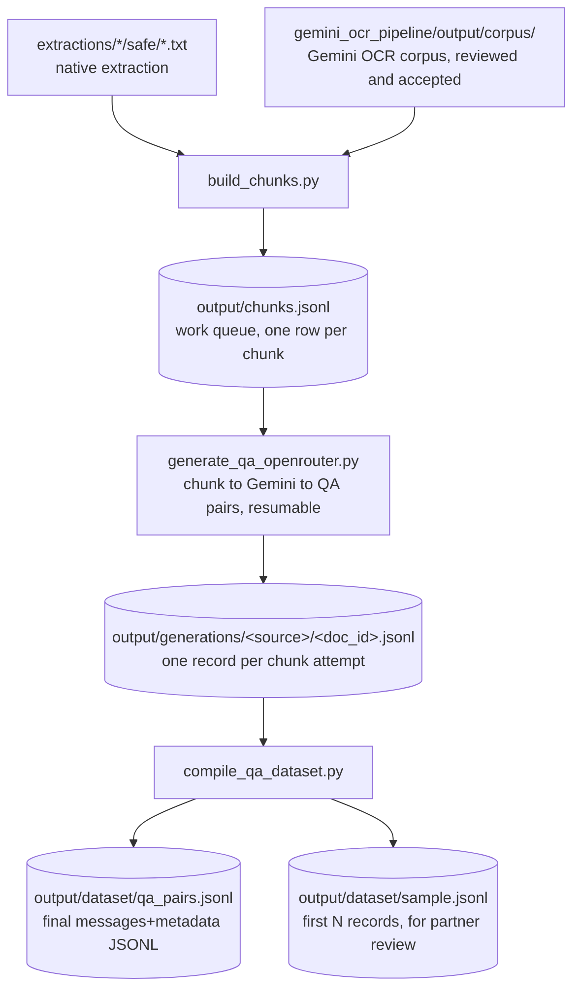

# QA-pair generation pipeline

Turns the clean Bahdini text corpus into instruction-tuning QA pairs for the
partner's Gemma 4 31B IT LoRA fine-tune, in the JSONL schema confirmed over
email (a `messages` list plus a `metadata` object). Mirrors the shape of
[gemini_ocr_pipeline/](../gemini_ocr_pipeline/): versioned prompt/config,
JSONL work queue, resumable per-document generation records, a compile step.

[gemma_tokenizer.py](gemma_tokenizer.py) is shared by the chunking and
compile stages: it loads the real `google/gemma-4-31B-it` tokenizer so every
token count in this pipeline (chunk sizes, final record lengths) is the
actual number of tokens Gemma will see, not a character-based guess. See
"The chunk queue" below for why that turned out to matter.

## Stages



## The chunk queue

```bash
python3 qa_generation/build_chunks.py
```

Source pool, by design (see
[discover_safe_docs](build_chunks.py#L126-L146) and
[discover_ocr_docs](build_chunks.py#L149-L168)), both included
unconditionally:

- `extractions/<source>/safe/*.txt`: native PDF text extraction, classified
  `safe` by `scripts/extract_pipeline.py`.
- `gemini_ocr_pipeline/output/corpus/`: rows with `classification ==
  "kurdish"`. This corpus has been reviewed and accepted (see
  [gemini_ocr_pipeline/README.md](../gemini_ocr_pipeline/README.md) and
  [docs/DOCUMENT_AI_OCR_GUIDE.md](../docs/DOCUMENT_AI_OCR_GUIDE.md)'s Stage D).

Chunking is paragraph-aware: [split_paragraphs](build_chunks.py#L34-L41)
splits on the extraction pipeline's page-break `\f` markers, then blank
lines. [chunk_text](build_chunks.py#L84-L123) then greedily packs paragraphs
up to [qa_config.TARGET_CHUNK_TOKENS](qa_config.py#L50-L63) (900, cap 1050,
floor 120), and [hard_split](build_chunks.py#L56-L81) with
[token_hard_cut](build_chunks.py#L44-L53) handle the rare oversized
paragraph. Sized so the *prompt* side of a QA record (system + question +
context) lands near the partner's ~1,000-token mean; see "Confirmed with the
partner" below for why the answer isn't part of that budget.

**Token counts are real, not estimated.** [gemma_tokenizer.py](gemma_tokenizer.py)
loads the actual `google/gemma-4-31B-it` tokenizer (already cached locally,
no model weights needed, just the tokenizer files) and every
chunk/paragraph/sentence is tokenized for real while packing, via
[count_tokens_batch](gemma_tokenizer.py#L66-L74) so a full run over the
corpus takes a few minutes (batched per document, see
[build_chunks.py main()](build_chunks.py#L171-L238)). This replaced an
earlier char-based estimate ([qa_config.CHARS_PER_TOKEN](qa_config.py#L24-L38))
that assumed ~3.2 chars/token from a generic words/chars rule of thumb;
measured against the real tokenizer, Bahdini Arabic-script text actually
runs **~1.6 chars/token**, roughly twice as dense as that guess assumed.
`CHARS_PER_TOKEN` now holds that measured value and is used only as a
fallback if the real tokenizer cannot be loaded (offline, transformers
missing, gated repo not accepted); every function in `gemma_tokenizer.py`
degrades to it transparently, with a one-time warning, so the pipeline still
runs either way.

Current run over both source pools: 5,370 documents to **338,350 chunks
(~253.4M real tokens)**, split roughly evenly between `safe_extraction`
(172,155 chunks) and `ocr_corpus` (166,195 chunks). Same total token volume
as chunking at the old 700/850 target, just packed into fewer, larger
chunks now that the confirmed budget gives context ~900 tokens of room
instead of 700 (see "Confirmed with the partner" below). See
`output/chunks_report.md` for the current per-source breakdown.

## Generation

```bash
python3 qa_generation/generate_qa_openrouter.py --max-chunks 20   # a quick sample first
python3 qa_generation/generate_qa_openrouter.py --budget-usd 25 --concurrency 16
```

[run()](generate_qa_openrouter.py#L193-L245) calls Gemini through OpenRouter
(reuses `OPENROUTER_API_KEY` from `.env`, same as
`gemini_ocr_pipeline/run_ocr_openrouter.py`) with the prompt in
[qa_config.QA_GENERATION_PROMPT_TEMPLATE](qa_config.py#L99-L141) (prompt
version `v2`), requesting `--pairs-per-chunk` (default 3) QA pairs as a
strict JSON list per chunk: `question`, `answer`, `question_type`, and an
optional `reasoning` (null unless the question genuinely needs it).
[parse_qa_response](generate_qa_openrouter.py#L68-L99) validates the result,
including that optional field. Resumable via
[process_chunk](generate_qa_openrouter.py#L149-L190): each attempted chunk
is appended to `output/generations/<source>/<document_id>.jsonl`, and a
re-run skips `chunk_id`s already recorded there. `--source`, `--origin`,
`--max-chunks`, and `--budget-usd` all narrow scope, so a small
representative sample can be produced (and sent to the partner) well before
the full run.

[qa_config.OPENROUTER_MODEL](qa_config.py#L150-L164) currently points at
`google/gemini-3.1-pro-preview`, a stronger tier than the OCR pipeline's
`flash-lite`, since QA generation leans more on instruction-following and
reasoning than transcription. Verify that model slug and the placeholder
per-token pricing against OpenRouter's current catalog before running at any
real budget.

## Compiling the dataset

```bash
python3 qa_generation/compile_qa_dataset.py --sample-size 20
```

[build_record](compile_qa_dataset.py#L76-L103) wraps every generated
`{question, answer, question_type, reasoning}` pair with its source chunk's
text into the agreed schema. A `CONTEXT_RATIO` share (default 0.7) of
records get a `Context: ...` block in the user message; the rest are a bare
question, per the partner's two serving modes (retrieval vs. not):

```json
{
  "messages": [
    {"role": "system", "content": "Answer the question in Bahdini Kurdish using the supplied context."},
    {"role": "user", "content": "Context: <chunk text>\n\nQuestion: <question>"},
    {"role": "assistant", "content": "<answer>", "reasoning": "<only present when the question needs it, else omitted>"}
  ],
  "metadata": {
    "document_id": "<source document id>",
    "chunk_id": "<source chunk id>",
    "source": "<source name, e.g. facebook, zcks, telegram_badini_book>",
    "question_type": "<factual, explanatory, summarization, definitional, inferential>",
    "context_mode": "<with_context, ~70%, or no_context, ~30%>"
  }
}
```

For a `no_context` record, the user message is just `"Question: <question>"`
and the system prompt switches to
[QA_SYSTEM_PROMPT_NO_CONTEXT](qa_config.py#L90-L95) (dropping "using the
supplied context", which would be wrong when there isn't one). The
`with_context`/`no_context` split is assigned per QA pair with a seeded RNG
(`CONTEXT_MODE_SEED = 42`), so it's reproducible across re-runs of the same
generation records rather than reshuffled every time.

**The `reasoning` key isn't a field we invented.** Gemma 4's own chat
template has a native thought channel, and its jinja source
(`~/.cache/huggingface/hub/models--google--gemma-4-31B-it/.../chat_template.jinja`)
reads `message.get('reasoning')` directly off the assistant message dict and
renders it into `<|channel>thought\n...\n<channel|>` ahead of the answer.
Verified directly:

```python
>>> tok.apply_chat_template([
...     {"role": "assistant", "content": "The final answer.", "reasoning": "Step by step reasoning."}
... ], tokenize=False)
'...<|turn>model\n<|channel>thought\nStep by step reasoning.\n<channel|>The final answer.<turn|>\n'
```

versus inlining a hand-rolled marker into `content` itself, which the
template does *not* specially handle (it just becomes literal text in the
answer) -- confirming the partner's instruction that reasoning has to live
in its own field, not inline in the content.

[main()](compile_qa_dataset.py#L134-L222) writes `output/dataset/qa_pairs.jsonl`
(the full set), `sample.jsonl` (up to `--sample-size` records, built by
[build_sample](compile_qa_dataset.py#L114-L131), which round-robins across
every `(question_type, context_mode)` combination actually generated so a
small sample still shows every type instead of whichever came first), and
`report.md` (counts per source/question_type/context_mode, how many records
carry a `reasoning` field, and how many exceed a 1,300-token flag threshold).
That check uses
[record_prompt_tokens](compile_qa_dataset.py#L106-L111), which calls
[gemma_tokenizer.count_prompt_tokens](gemma_tokenizer.py#L88-L99): tokens for
system + question + context only, rendered exactly as Gemma would see them
before generating (`add_generation_prompt=True`) -- the answer is
deliberately excluded, per the confirmed budget below.

## Confirmed with the partner

Answers to the open questions from the earlier email thread, and what
changed in [qa_config.py](qa_config.py) as a result:

1. **Messages structure is final** -- no flat `context`/`question`/`answer`
   fields needed. The partner has their own preprocessing step before
   feeding Gemma 4, and control tokens are never inserted manually here
   (confirmed as already the right approach).
2. **Token budget** (~1,000) covers system + question + context only, *not*
   the answer, and it's a mean, not a hard cap ("ok to go over in some
   cases"). This raised the context target from 700 to
   [TARGET_CHUNK_TOKENS = 900](qa_config.py#L50-L63) (cap 1050) and moved
   the QC check in `compile_qa_dataset.py` from full-record tokens to
   prompt-only tokens (see above).
3. **Not every pair needs context.** [CONTEXT_RATIO = 0.7](qa_config.py#L65-L70)
   controls the with/without split, surfaced in `metadata.context_mode`.
4. **Answers don't have to be strictly extractive** -- reasonable inference
   is fine as long as it stays supported by the context and introduces no
   outside facts. This was already the instruction in
   [QA_GENERATION_PROMPT_TEMPLATE](qa_config.py#L99-L141); confirmed
   unchanged.
5. **Question types**: `factual, explanatory, summarization, definitional,
   inferential` ([qa_config.QUESTION_TYPES](qa_config.py#L86)). The
   partner asked to see all of them in the sample, which is what
   `build_sample`'s round-robin guarantees.
6. **Reasoning goes in a separate field**, not inline in the content --
   implemented as the assistant message's native `reasoning` key described
   above, driven by a new rule in `QA_GENERATION_PROMPT_TEMPLATE` asking
   Gemini to fill it in only when a question needs multi-step reasoning.

Two judgment calls made here that the partner didn't spell out, both easy
to change in `qa_config.py` if they want something different:
`QA_SYSTEM_PROMPT_NO_CONTEXT`'s exact wording, and the 1,300-token flag
threshold (a 30% allowance over the ~1,000 mean) in `compile_qa_dataset.py`.
