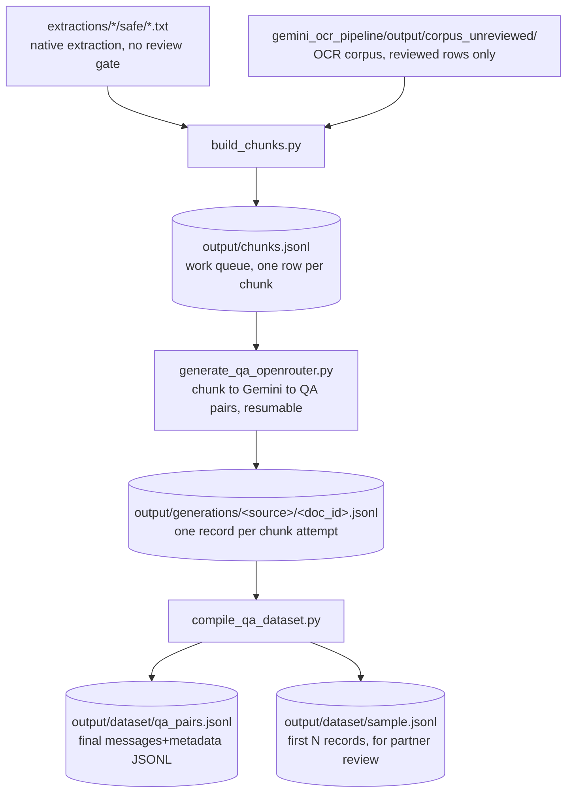

# QA-pair generation pipeline

Turns the clean Bahdini text corpus into instruction-tuning QA pairs for the
partner's Gemma 4 31B IT LoRA fine-tune, in the JSONL schema confirmed over
email (a `messages` list plus a `metadata` object). Mirrors the shape of
[gemini_ocr_pipeline/](../gemini_ocr_pipeline/): versioned prompt/config,
JSONL work queue, resumable per-document generation records, a compile step.

[gemma_tokenizer.py](gemma_tokenizer.py) is shared by the chunking and
compile stages: it loads the real `google/gemma-4-31B-it` tokenizer so every
token count in this pipeline (chunk sizes, final record lengths) is the
actual number of tokens Gemma will see, not a character-based guess. See
"The chunk queue" below for why that turned out to matter.

## Stages



## The chunk queue

```bash
python3 qa_generation/build_chunks.py
```

Source pool, by design (see
[discover_safe_docs](build_chunks.py#L132-L152) and
[discover_ocr_docs](build_chunks.py#L155-L186)):

- `extractions/<source>/safe/*.txt`: native PDF text extraction, already
  classified `safe`. Included unconditionally.
- `gemini_ocr_pipeline/output/corpus_unreviewed/`: only rows with
  `classification == "kurdish"` and `review_status == "reviewed"`. That
  pipeline's own rule is that nothing OCR'd is promoted to training data
  automatically; as of this writing every OCR'd document is still
  `unreviewed`, so none of it feeds the chunk queue by default.
  `--include-unreviewed-ocr` opts into unreviewed-but-high-completeness OCR
  text anyway (prints a loud warning), useful only for a quick throwaway
  sample, never for the delivered dataset.

Chunking is paragraph-aware: [split_paragraphs](build_chunks.py#L40-L47)
splits on the extraction pipeline's page-break `\f` markers, then blank
lines. [chunk_text](build_chunks.py#L90-L129) then greedily packs paragraphs
up to [qa_config.TARGET_CHUNK_TOKENS](qa_config.py#L50-L61) (700, cap 850,
floor 120), and [hard_split](build_chunks.py#L62-L87) with
[token_hard_cut](build_chunks.py#L50-L59) handle the rare oversized
paragraph. Sized so a full QA record (system + context + question + answer)
lands near the partner's ~1,000-token/record estimate.

**Token counts are real, not estimated.** [gemma_tokenizer.py](gemma_tokenizer.py)
loads the actual `google/gemma-4-31B-it` tokenizer (already cached locally,
no model weights needed, just the tokenizer files) and every
chunk/paragraph/sentence is tokenized for real while packing, via
[count_tokens_batch](gemma_tokenizer.py#L66-L74) so a full run over the
corpus takes under 2 minutes (batched per document, see
[build_chunks.py main()](build_chunks.py#L189-L268)). This replaced an
earlier char-based estimate ([qa_config.CHARS_PER_TOKEN](qa_config.py#L24-L38))
that assumed ~3.2 chars/token from a generic words/chars rule of thumb;
measured against the real tokenizer, Bahdini Arabic-script text actually
runs **~1.6 chars/token**, roughly twice as dense as that guess assumed.
`CHARS_PER_TOKEN` now holds that measured value and is used only as a
fallback if the real tokenizer cannot be loaded (offline, transformers
missing, gated repo not accepted); every function in `gemma_tokenizer.py`
degrades to it transparently, with a one-time warning, so the pipeline still
runs either way.

Current run over the safe-extraction pool: 1,853 documents to **219,171
chunks (~131.6M real tokens)**. That is roughly double the chunk count and
total-token estimate of the first run before the real tokenizer was wired
in: the old ~3.2 chars/token guess was undercounting tokens by close to 2x,
so chunks were coming out nearly twice as token-heavy as the "700-token
target" implied, and a few thin documents were being dropped as
sub-minimum that actually clear the 120-token floor once counted correctly.
See `output/chunks_report.md` for the current per-source breakdown.

## Generation

```bash
python3 qa_generation/generate_qa_openrouter.py --max-chunks 20   # a quick sample first
python3 qa_generation/generate_qa_openrouter.py --budget-usd 25 --concurrency 16
```

[run()](generate_qa_openrouter.py#L188-L240) calls Gemini through OpenRouter
(reuses `OPENROUTER_API_KEY` from `.env`, same as
`gemini_ocr_pipeline/run_ocr_openrouter.py`) with the prompt in
[qa_config.QA_GENERATION_PROMPT_TEMPLATE](qa_config.py#L74-L122), requesting
`--pairs-per-chunk` (default 3) QA pairs as a strict JSON list per chunk.
[parse_qa_response](generate_qa_openrouter.py#L68-L94) validates the result.
Resumable via [process_chunk](generate_qa_openrouter.py#L144-L185): each
attempted chunk is appended to
`output/generations/<source>/<document_id>.jsonl`, and a re-run skips
`chunk_id`s already recorded there. `--source`, `--origin`, `--max-chunks`,
and `--budget-usd` all narrow scope, so a small representative sample can be
produced (and sent to the partner) well before the full run.

[qa_config.OPENROUTER_MODEL](qa_config.py#L131-L145) currently points at
`google/gemini-3.1-pro-preview`, a stronger tier than the OCR pipeline's
`flash-lite`, since QA generation leans more on instruction-following and
reasoning than transcription. Verify that model slug and the placeholder
per-token pricing against OpenRouter's current catalog before running at any
real budget.

## Compiling the dataset

```bash
python3 qa_generation/compile_qa_dataset.py --sample-size 20
```

[build_record](compile_qa_dataset.py#L57-L71) wraps every generated
`{question, answer, question_type}` pair with its source chunk's text into
the agreed schema:

```json
{
  "messages": [
    {"role": "system", "content": "Answer the question in Bahdini Kurdish using the supplied context."},
    {"role": "user", "content": "Context: <chunk text>\n\nQuestion: <question>"},
    {"role": "assistant", "content": "<answer>"}
  ],
  "metadata": {
    "document_id": "<source document id>",
    "chunk_id": "<source chunk id>",
    "source": "<source name, e.g. facebook, zcks, telegram_badini_book>",
    "question_type": "<factual, explanatory, summarization, definitional, inferential>"
  }
}
```

[main()](compile_qa_dataset.py#L81-L151) writes `output/dataset/qa_pairs.jsonl`
(the full set), `sample.jsonl` (first N records, this is what to hand the
partner for early review), and `report.md` (counts per source/question_type,
plus how many records exceed a 1,200-token flag threshold against the
~1,000-token/record target). The per-record count comes from
[record_token_count](compile_qa_dataset.py#L74-L78), which calls
[gemma_tokenizer.count_chat_tokens](gemma_tokenizer.py#L77-L85): it renders
the actual Gemma chat template, so BOS and turn-marker overhead is included,
not just raw message-content length, using the same real tokenizer as
chunking, not a re-estimate.

## Assumptions baked in here, confirm before scaling up

The email thread did not get a direct answer on several points before this
groundwork was built; defaults were chosen conservatively and are easy to
change in [qa_config.py](qa_config.py):

1. **Token budget** (~1,000/record) is treated as covering the *complete*
   record (system + context + question + answer), not context alone.
2. **Every QA pair carries its supporting context** in the `user` message
   (matches the schema the partner already confirmed works for them).
3. **Answers are extractive-first**, with reasonable inference/synthesis
   allowed for `explanatory`/`summarization` questions but never introducing
   facts absent from the context (instructed directly in
   [QA_GENERATION_PROMPT_TEMPLATE](qa_config.py#L87-L122)).
4. **Question types**: `factual, explanatory, summarization, definitional,
   inferential` ([qa_config.QUESTION_TYPES](qa_config.py#L80)), a superset
   of the partner's example list ("factual, explanatory, summarization,
   etc.").

If the partner's actual answers to those clarifying questions differ,
update `qa_config.py` (prompt template, `QUESTION_TYPES`,
`TARGET_CHUNK_TOKENS`) and re-run; nothing downstream needs to change shape.
