# Bahdini Kurdish QA Generation

**How 246,515 text chunks became 952,801 instruction-tuning records, and what is wrong with them**

Corpus built 6–10 August 2026 · `google/gemini-3.1-flash-lite` · prompt v3 · $301.41

prepared by: [sawab.aziz@newrozholdings.com](mailto:sawab.aziz@newrozholdings.com)

> **What this document is**
>
> This is the single source of truth for the QA-generation stage of the Bahdini
> Kurdish fine-tuning corpus. It begins where the chunking stage ended, with a
> finished work queue of 246,515 text chunks, and follows every step from there
> to the delivered dataset, including the exact prompt sent to the model, every
> token and dollar figure, the failure modes encountered, and the quality
> problems that remain unresolved. Design decisions are recorded with the
> reasoning behind them, so that a reader can tell which choices were forced,
> which were measured, and which are still open to revision.

*This is the Markdown edition of the same report typeset in
[`qa_generation_report.tex`](qa_generation_report.tex). Content is identical;
the TikZ diagrams are rendered as Mermaid here.*

---

## Contents

- [At a glance](#at-a-glance)
- [Where this report begins](#where-this-report-begins)
  - [What a chunk is](#what-a-chunk-is)
  - [Chunk identifiers carry their origin](#chunk-identifiers-carry-their-origin)
  - [The queue survived two corruption gates](#the-queue-survived-two-corruption-gates)
- [The pipeline end to end](#the-pipeline-end-to-end)
- [Generation](#generation)
  - [The model, and why this one](#the-model-and-why-this-one)
  - [The exact prompt](#the-exact-prompt)
  - [Prompt version history](#prompt-version-history)
  - [What the model returned](#what-the-model-returned)
  - [Failure handling](#failure-handling)
  - [Throughput, concurrency and the overnight run](#throughput-concurrency-and-the-overnight-run)
  - [Cost, and a bug that mattered](#cost-and-a-bug-that-mattered)
- [From pairs to training records](#from-pairs-to-training-records)
  - [How 246,515 chunks became 952,801 records](#how-246515-chunks-became-952801-records)
  - [Record anatomy](#record-anatomy)
- [The finished dataset](#the-finished-dataset)
  - [Size in tokens](#size-in-tokens)
  - [Length distribution](#length-distribution)
  - [Context modes](#context-modes)
  - [Composition](#composition)
- [Quality findings](#quality-findings)
  - [Sorani source text](#sorani-source-text)
  - [Latin-script leakage](#latin-script-leakage)
  - [Duplicate questions](#duplicate-questions)
  - [Off-schema rows](#off-schema-rows)
- [Open decisions](#open-decisions)
- [Artifacts and reproduction](#artifacts-and-reproduction)

---

## At a glance

| Input | | Output | |
|---|---:|---|---:|
| Chunks in the work queue | 246,515 | QA pairs generated | 952,822 |
| Source documents | 4,306 | Records delivered | 952,801 |
| Source corpora | 8 | Training tokens | 644,306,453 |
| Context tokens in queue | 183,119,057 | Pairs with reasoning | 508,061 |

| API consumption | | Cost | |
|---|---:|---|---:|
| Calls made | 248,243 | Total spend | $301.41 |
| Input tokens billed | 304,524,932 | Per 1,000 pairs | $0.316 |
| Output tokens billed | 150,188,299 | Per source chunk | $0.00122 |
| Total tokens billed | 454,713,231 | Cost-model error | 0.03% |

The two token totals above measure different things and are not comparable.
**454.7M** is what the generation provider billed: the prompt sent to Gemini
plus the JSON it returned, counted by the provider's own tokenizer. **644.3M**
is what the finished dataset contains: the assembled training records counted
with Gemma's tokenizer. The delivered corpus is larger than the API traffic
because each chunk's context is sent to the generator *once* but is then written
into roughly three of the four training records built from it.

---

## Where this report begins

The chunking stage is documented separately. This report takes its output as a
given and starts there, but three properties of that output determine everything
downstream and are restated here.

### What a chunk is

A chunk is a contiguous passage of Bahdini text, packed paragraph-first to a
target of 900 real Gemma tokens with a hard ceiling of 1,050 and a floor of 120.
The target was not chosen for the generator's convenience: the partner specified
a budget of roughly 1,000 tokens for the *prompt side* of a finished training
record (system message plus question plus context, with the answer excluded),
expressed as a mean rather than a cap. Measuring the fixed overhead of Gemma's
chat template at 77 tokens for a representative record left approximately 900
tokens for context, which is where the target came from.

### Chunk identifiers carry their origin

Every chunk id has the form `<origin>-<document_id>-<index>`. The origin prefix
is load-bearing rather than decorative. The same source document can exist in
both pools, native PDF text extraction and Gemini OCR of the same file, and
both pools deliberately hash to the same `document_id` so that identifiers line
up across pipelines. Before the prefix was added, 626 such documents produced
colliding chunk ids: **41,457 duplicated ids spanning 82,914 chunks, 32.5% of
the queue.** That collision would have silently corrupted both the resume logic
and the chunk-text lookup at compile time. The current queue has zero
collisions.

### The queue survived two corruption gates

| Stage | Count | Note |
|---|---:|---|
| Documents seen | 5,219 | after character-corruption backfill |
| Skipped, no usable chunks | 16 | shorter than the 120-token floor |
| Skipped, likely garbled | 264 | median chars/token below 1.5 |
| Documents contributing chunks | 4,939 | |
| **Chunks written** | **246,515** | 183,119,057 context tokens |

The garbled-document gate deserves a note because it is the kind of check that
is easy to get wrong. Legacy Kurdish font encodings can substitute the wrong
Unicode characters wholesale, producing text with plausible Kurdish letter
frequencies that spells no real words. Presentation-form ratios do not catch it.
What separates it cleanly is the real tokenizer's chars-per-token ratio:
verified-clean OCR text sits at 1.9–2.2, corrupted native extractions at
1.0–1.5. The gate is applied per document on the **median** across that
document's own chunks, not per chunk, because line-wrapping noise makes
individual chunks in a genuinely clean document dip as low as 0.12.

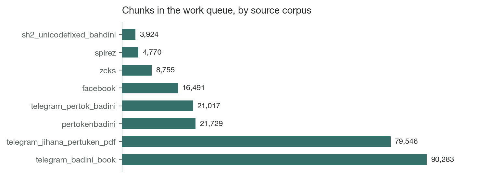

By origin the queue splits 166,169 chunks from the reviewed OCR corpus against
80,346 from native extraction, roughly two to one in favour of OCR, because OCR
reads the rendered page image and is therefore immune to the PDF font problems
that sent so many native extractions to the reject pile.

---

## The pipeline end to end

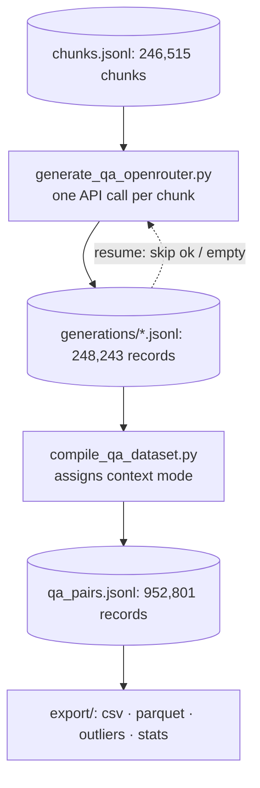

The dashed edge is the resume path and is what made a four-day, restartable run
possible. Each processed chunk appends one record to a per-document file, and a
re-run reads those files first and skips anything already recorded as `ok` or
`empty`. Failures are deliberately *not* recorded as done, so they are retried
automatically on the next run without a separate pass.

---

## Generation

### The model, and why this one

| Parameter | Value and reasoning |
|---|---|
| Model | `google/gemini-3.1-flash-lite` via OpenRouter |
| Temperature | `0.7`: four pairs are requested in a single call, and lower temperatures made the four read as restatements of one another |
| Max output tokens | `2048`: four Bahdini pairs with reasoning average 605 output tokens, so this is headroom, not a target |
| Messages | *one* `user` message. No system role is sent |
| Response format | none: no JSON mode; the schema is enforced by the prompt and validated after the fact |
| Request timeout | 180 seconds per attempt |
| Prompt version | `v3`, recorded on every output record |

The tier was chosen by pilot rather than by assumption. Forty chunks were run at
three pairs each and forty at four; `flash-lite` returned the full requested
count on 39 of 40 either way, and the fourth pair read as a genuinely distinct
question rather than filler. The stronger `pro` tier was therefore not needed,
and the difference is roughly a factor of five in cost.

> **Two prompts, easily confused**
>
> The configuration defines `QA_GENERATION_PROMPT_TEMPLATE` and
> `QA_SYSTEM_PROMPT`, and they are unrelated. The first is what Gemini sees at
> generation time and never appears in the delivered dataset. The second is what
> Gemma sees at fine-tuning time, written into the `system` slot of finished
> records by the compile step, and never sent to Gemini. Editing the wrong one
> changes nothing about what is generated, or everything about the delivered
> records while leaving generation untouched.

### The exact prompt

Reproduce this at any time with
`python3 -c "import qa_config as c; print(c.build_qa_prompt('<CHUNK>'))"`.
Rendered with `n_pairs=4`, the complete user message is:

```text
You are building instruction-tuning data for a 100% pure Bahdini (Badini) Kurdish language model. Bahdini is spoken by people in Dohuk city and governorate.

Below is one excerpt ("the context") from a Bahdini text. Write 4 question-answer pairs a person could ask about this excerpt, as if using it for reading comprehension / instruction fine-tuning.

Rules:
- CRITICAL DIALECT RULE: Both the question and the answer MUST be written in 100% pure Bahdini Kurdish (Arabic script) exactly as spoken in Dohuk. Do NOT mix in any Sorani words, phrases, or grammar. Do NOT use general Kurmanji vocabulary or Latin script. You must ensure the dialect is strictly pure Bahdini.
- The answer must be grounded in the context: prefer extractive answers quoting or closely paraphrasing the text; reasonable inference/synthesis is fine for explanatory or summarization questions, but never introduce facts that are not supported by the context.
- Do not ask about the excerpt's formatting, page numbers, or the fact that it is an excerpt.
- Vary the question_type across the set; choose only from: factual, explanatory, summarization, definitional, inferential.
- If the context is too short, garbled, or content-free to support 4 distinct, well-grounded questions, return fewer pairs (an empty list is fine) rather than inventing filler.
- If answering the question genuinely requires connecting multiple details in the context or drawing a conclusion beyond a single stated fact, also fill in "reasoning": a brief step-by-step justification, in pure Bahdini Kurdish, for how the answer follows from the context. If the question is directly answerable by quoting or restating one explicit fact, set "reasoning" to null; do not pad it with filler.

Output strict JSON only: a list of objects, no markdown fences, no commentary before or after. Each object must have exactly these keys:
  "question": string
  "answer": string
  "question_type": one of ['factual', 'explanatory', 'summarization', 'definitional', 'inferential']
  "reasoning": string or null (see rule above)

Context:
"""
{context}
"""
```

Two details worth knowing before anyone edits this. First, the
`one of ['factual', ...]` line renders a raw Python list repr, quotes included,
because that value is interpolated directly while the bullet above it is
comma-joined. It is cosmetically untidy and the model complies with it
regardless, but tidying it mid-corpus would mean a new prompt version, and a
version bump part-way through leaves the delivered dataset generated under two
different sets of instructions. Second, the shouty phrasing of the dialect rule
is deliberate: version v2 said only "must be written in Bahdini Kurdish (do not
switch to Sorani, Latin-script Kurdish, or Arabic)", and review found Sorani and
general-Kurmanji vocabulary leaking in anyway. Version v3 names the three
prohibitions separately and marks the rule critical.

### Prompt version history

| Version | Change |
|---|---|
| v1 | Initial. Three pairs per chunk, 700-token context target, no reasoning field. |
| v2 | Added the optional `reasoning` field, the 70/30 context split, and the 900-token context target, after the partner confirmed the token budget covers the prompt side only. |
| v3 | Current. Rewrote the dialect rule after Sorani leakage was observed; reasoning must also be pure Bahdini. All 248,243 records on disk are v3. |

### What the model returned

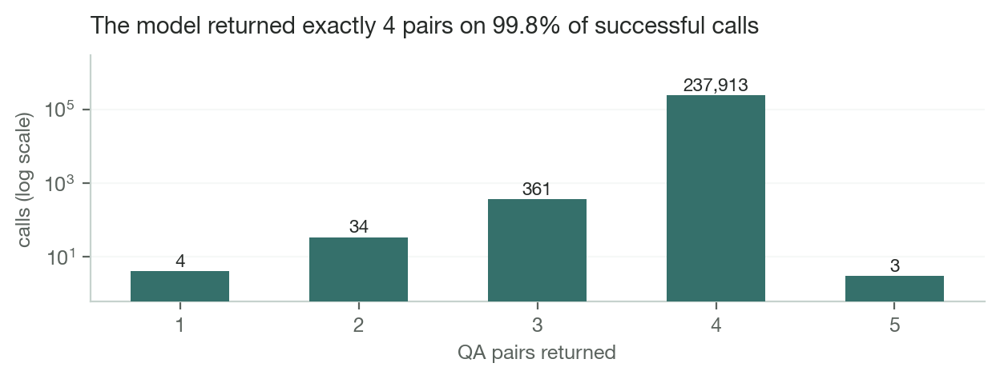

Of 238,315 successful calls, 237,913 returned exactly the four pairs requested.
**99.83%**. The parser accepts a variable count by design, so the handful that
returned one, two, three or five pairs were kept rather than discarded. Five
pairs is possible because the parser validates structure, not cardinality.

| Status | Calls | Share | Meaning and retry behaviour |
|---|---:|---:|---|
| `ok` | 238,315 | 95.99% | at least one valid pair. Not retried |
| `empty` | 8,209 | 3.31% | model returned `[]`: the intended answer for a garbled or content-free chunk. Not retried |
| `parse_error` | 1,687 | 0.68% | response was not a JSON list, or every entry was malformed. **Retried automatically** |
| `error` | 32 | 0.01% | HTTP or network failure after five attempts. **Retried automatically** |

**The empty responses are not failures.** They are the model correctly declining
to invent content for a chunk that cannot support four grounded questions, which
the prompt explicitly instructs it to do. Treating that 3.31% as a defect would
mean asking for filler. What genuinely produced nothing is `parse_error` plus
`error`: 1,719 chunks, 0.70% of the queue.

### Failure handling

Transport failures retry five times with exponential backoff plus jitter,
computed as `2 · 2^n + rand(0,1)` seconds, on HTTP 429 and any 5xx. HTTP 402 and
403 are treated as terminal and are *not* retried: they mean credit exhausted or
key rejected, and retrying them would burn five backoff cycles per chunk against
a dead key while the run appeared to be working. Hitting either sets a stop flag
that drains in-flight requests and ends the run cleanly.

At the pair level, the parser strips any markdown fence, parses the JSON, and
keeps only entries with a non-empty question, a non-empty answer, and a
`question_type` drawn from the five agreed values. A single malformed pair inside
an otherwise-valid response is dropped; it does not fail the chunk.

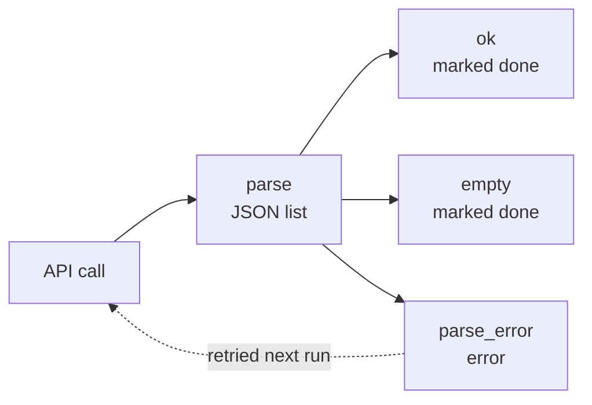

### Throughput, concurrency and the overnight run

The full corpus was generated across several sessions between 6 and 10 August
2026. Sustained throughput was roughly **450 chunks per minute at concurrency 32**
with a dispatch batch of 128, up from about 230 per minute at concurrency 16.

Batch size matters more than it looks: the dispatcher waits for every request in
a batch before starting the next, so the batch is a barrier. Setting it at or
below the concurrency level starves the semaphore whenever a single slow request
holds up its batch, which is why 128 pairs with a concurrency of 32 rather than
the default 16.

The unattended portion ran under a supervisor that restarts the generator if it
exits with work pending. That loop introduced one hazard worth recording: the
generator's budget cap is evaluated *per run*, so a naive restart loop would
silently reset the cap on every iteration. The supervisor therefore reads
remaining credit back from the provider before each attempt and passes that,
minus a small reserve, as that attempt's cap, so the ceiling tracks cumulative
spend across restarts, with the provider's own key limit as a hard backstop
underneath.

### Cost, and a bug that mattered

| Quantity | Tokens | Rate (USD/M) |
|---|---:|---:|
| Input (prompt) | 304,524,932 | 0.25 |
| Output (completion) | 150,188,299 | 1.50 |
| **Total billed** | **454,713,231** | |

Mean consumption per call was 1,227 input and 605 output tokens. Total spend was
**$301.41**: $0.316 per thousand pairs, or $0.00122 per source chunk.

Pricing is keyed by exact model slug. It previously was not, a single pair of
constants for the `pro` tier was applied to every run regardless of which model
was actually called, which overstated `flash-lite` runs by a factor of 3.75. That
was not merely a display error. **The budget cap is evaluated against this
estimate**, so an inflated rate makes a run halt far short of its real budget
while appearing to have completed: the first full-corpus attempt carried a $350
cap and would have stopped at roughly 32% of the queue having actually spent
about $93.

> **The cost model is validated, not assumed**
>
> Recomputing every record on disk from its stored token counts gives $50.04 for
> the first API key; the provider's own usage endpoint reports $50.0542 for the
> same key. That is a 0.03% discrepancy across 41,467 calls, which is why the
> figures in this report are stated as measurements rather than estimates. An
> unknown model slug deliberately falls back to the most expensive known rate, so
> the failure mode is stopping early rather than overspending.

---

## From pairs to training records

### How 246,515 chunks became 952,801 records

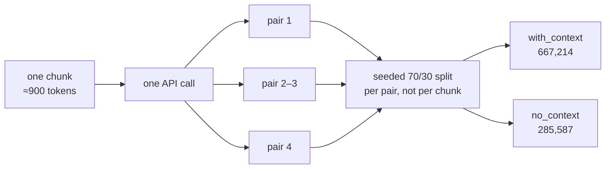

The context mode is assigned **per pair** with a fixed seed, not per chunk. That
matters: assigning per chunk would mean all four pairs from a passage share a
mode, which correlates the split with document content. A fixed seed makes the
assignment reproducible across re-runs of the compile step over the same
generation records rather than reshuffled each time.

The delivered count is 952,801 rather than the 952,822 pairs on record. The
difference is 21 pairs referencing six chunk ids that no longer exist in the
queue, orphaned when the corpus was rebuilt after the character-corruption fix.
They are dropped rather than delivered without their grounding text.

### Record anatomy

```json
{
  "messages": [
    {"role": "system",    "content": "Answer the question in Bahdini Kurdish using the supplied context."},
    {"role": "user",      "content": "Context: <chunk>\n\nQuestion: <question>"},
    {"role": "assistant", "content": "<answer>", "reasoning": "<present only when needed>"}
  ],
  "metadata": {
    "document_id":   "<source document id>",
    "chunk_id":      "<source chunk id>",
    "source":        "<corpus name>",
    "question_type": "<one of five>",
    "context_mode":  "with_context | no_context"
  }
}
```

For a `no_context` record the user message is only `Question: <question>`, and
the system prompt switches to "Answer the question in Bahdini Kurdish", dropping
"using the supplied context", which would be false when there is none. That
second system string was a judgement call rather than a specified requirement,
and is a one-line change if different wording is preferred.

> **The reasoning field is native, not invented**
>
> Gemma 4's own chat template reads `message.get('reasoning')` directly off the
> assistant message and renders it into the model's thought channel ahead of the
> answer. Verified directly against the template: passing `reasoning` as a
> sibling key of `content` produces a `<|channel>thought` block, whereas inlining
> a hand-rolled marker into the content itself is treated as literal answer text.
> This is why reasoning lives in its own field rather than being concatenated
> into the answer.

---

## The finished dataset

### Size in tokens

Every record was tokenized with the real `google/gemma-4-31B-it` tokenizer. The
chat template's own per-record overhead was measured at 18.68 tokens on a sample
rather than assumed.

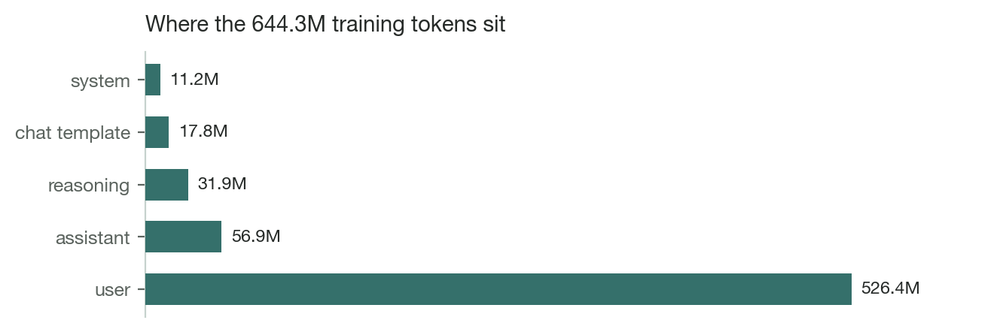

| Component | Tokens | Share |
|---|---:|---:|
| User message (context + question) | 526,428,585 | 81.7% |
| Assistant answer | 56,938,845 | 8.8% |
| Reasoning | 31,896,635 | 5.0% |
| Chat template overhead | 17,798,323 | 2.8% |
| System prompt | 11,244,065 | 1.7% |
| **Total** | **644,306,453** | **100%** |

The single most consequential number here is the first one. **Context is 82% of
the training budget**, so any proposal to trim, filter or re-balance context is a
proposal about almost the entire dataset, while any change to answers or
reasoning touches at most a seventh of it.

### Length distribution

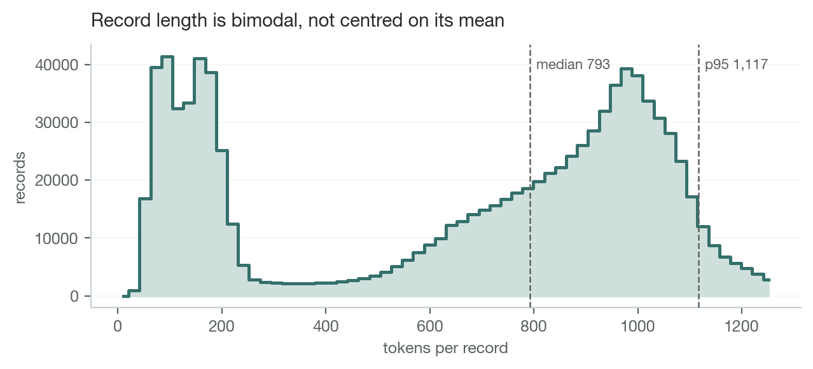

**The mean is the wrong summary for this dataset.** Record length is bimodal:
bare-question records cluster near 90 tokens and context-carrying ones near 950,
and the mean of 658 falls in the valley between them, describing almost no actual
record. The two populations should be reported, and batched, separately.

| Field | Min | p05 | Median | Mean | p95 | Max |
|---|---:|---:|---:|---:|---:|---:|
| User (prompt side) | 3 | 23 | 691 | 553 | 992 | 1,340 |
| Assistant (answer) | 2 | 24 | 59 | 60 | 100 | 399 |
| Whole record | 26 | 80 | 793 | 658 | 1,117 | 1,535 |

Against the partner's roughly 1,000-token prompt-side mean, measured p95 is 992
and only 27 records in the entire corpus exceed the 1,300-token flag threshold.
a 30% allowance over the target. The budget was met comfortably.

### Context modes

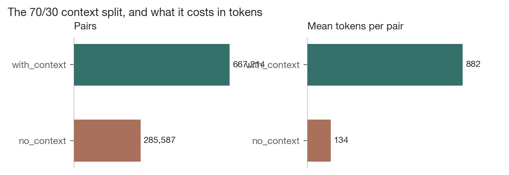

The realised split is 667,214 `with_context` against 285,587 `no_context`:
**70.03% / 29.97%**, matching the configured ratio of 0.7 to two decimal places.
The two modes exist because the model will be served both ways
(retrieval-augmented and bare), and a model trained only on context-bearing
prompts tends to refuse or hedge when the context is absent. Both modes were
generated with full context visible to the generator, so the bare-question pairs
remain grounded in real source text even though that text is not shown at
training time.

### Composition

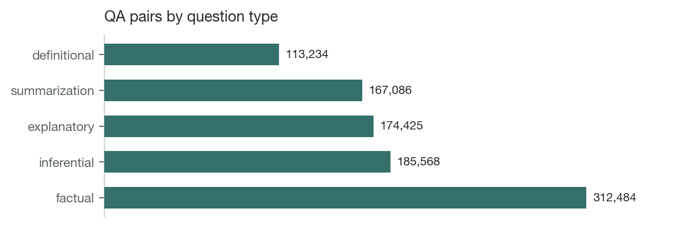

| Source corpus | Pairs | Share |
|---|---:|---:|
| telegram_badini_book | 350,085 | 36.7% |
| telegram_jihana_pertuken_pdf | 307,525 | 32.3% |
| pertokenbadini | 85,524 | 9.0% |
| telegram_pertok_badini | 81,012 | 8.5% |
| facebook | 60,442 | 6.3% |
| zcks | 33,971 | 3.6% |
| spirez | 18,728 | 2.0% |
| sh2_unicodefixed_bahdini | 15,514 | 1.6% |

Two Telegram book collections are 69% of the corpus. This reflects what Bahdini
text exists in bulk rather than any sampling decision, but it has a direct
consequence: **any train/eval split must be stratified by source**, or the
evaluation set measures those two collections and nothing else.

---

## Quality findings

Every anomaly found is collected in `qa_outliers.csv`, one row per flagged pair,
keyed by `row_index` back into the delivered file so any decision maps to
specific records. A pair can carry several flags.

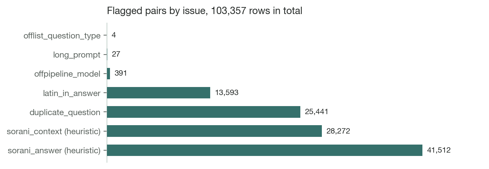

| Flag | Rows | Nature |
|---|---:|---|
| `sorani_answer` | 41,512 | heuristic |
| `sorani_context` | 28,272 | heuristic; the case that leaks into training |
| `duplicate_question` | 25,441 | objective |
| `latin_in_answer` | 13,593 | objective; violates the prompt outright |
| `offpipeline_model` | 391 | objective; from a one-off experiment |
| `long_prompt` | 27 | objective; over the 1,300-token flag |
| `offlist_question_type` | 4 | objective |
| **Total flagged rows** | **103,357** | 10.85% of the dataset |

5,750 pairs carry two or more flags. Those are the highest-value rows to read
first, because independent signals agreeing is far stronger evidence than any
single heuristic firing alone.

> **The two dialect flags are a queue, not a verdict**
>
> They come from a marker-frequency heuristic with no validated threshold, and
> several of its markers occur in both dialects. The counts indicate how much
> material is worth inspecting; they do not state how many rows are wrong. Both
> `sorani_score` and `bahdini_score` are exposed as columns precisely so the
> cutoff can be re-judged against real labels. Every other flag in the table
> above is an objective, checkable property.

### Sorani source text

The most consequential finding. Some source chunks are Sorani rather than
Bahdini. The generator handles this correctly, it obeys the dialect rule and
writes the question and answer in Bahdini regardless. The leak is at compile
time: for `with_context` records the raw chunk is placed in the user message, so
Sorani text enters the training prompt of an otherwise-Bahdini record.

> **Sorani context found in the facebook corpus**, chunk text, excerpt
>
> <div dir="rtl">قەڵەمە پارکەرەکەی باوکم … بۆ وا بە کوڵ دەگریت؟</div>
>
> Sorani orthography throughout, the `ەکەی` definite suffix and the `دەگریت`
> verb form are not Bahdini. The question and answer generated from this chunk
> are correct Bahdini; the context beneath them is not.

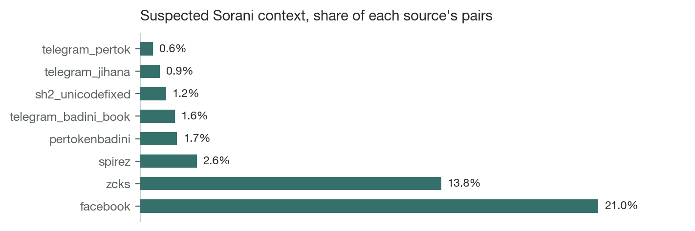

Plotted as a rate rather than a count deliberately: by absolute count the large
Telegram corpora appear worst simply because they contain 350,000 pairs each.
Normalising shows the problem is concentrated in `facebook` (21.0%) and `zcks`
(13.8%), an order of magnitude above the book corpora, which is consistent with
provenance, since those two are social posts and a mixed-dialect website rather
than curated Bahdini books. The same concentration appeared in an independent
estimate made on a 2,404-row stratified sample when the corpus was only 17%
complete, which is weak corroboration that the signal is real even though the
threshold is not calibrated.

### Latin-script leakage

13,593 answers (1.43%) contain at least one Latin character, against a prompt
that forbids Latin script outright. The rate was also 1.43% when the corpus was
17% complete, so this is structural rather than an artefact of the later run. The
class is mixed: proper nouns and citations alongside genuine leakage. The tail is
unambiguous, the worst single record carries 244 Latin characters, which turn
out to be Emily Dickinson's *"I never saw a moor"* sitting in the source text.

### Duplicate questions

25,441 pairs (2.7%) repeat a question string seen earlier. **Do not deduplicate
on the question alone.** The repeats are dominated by generic questions, the
kind askable of almost any passage, which arise independently across unrelated
chunks and carry entirely different answers. Global deduplication on the question
string would delete legitimately distinct training pairs. Deduplicate on the
`(question, answer)` pair, or on question within a document.

### Off-schema rows

175 chunks, producing 391 pairs, were generated by a one-off manual experiment
using a different model outside this pipeline. They carry no token counts and
therefore contribute nothing to any cost figure in this report. They are also the
only source of the four off-list `question_type` values in the corpus
(`descriptive` three times, `comparative` once), which the pipeline's own parser
would have rejected. The pairs are otherwise valid Bahdini and were left in
place; the compile step does not re-validate `question_type`, so filter there if
strict schema conformance is required.

---

## Open decisions

None of the following are settled. Each requires a Bahdini speaker's judgement,
and each has an inexpensive fix once decided.

1. **Calibrate the dialect threshold.** Label a few hundred rows from the
   `facebook` and `zcks` slice by eye, then set the cutoff against those labels.
   Everything else on this list is cheaper than this, and none of it is blocked
   by it.

2. **Handle Sorani contexts.** The cheap fix is at compile time: force affected
   pairs to `no_context` rather than dropping them, which keeps the Bahdini
   question and answer and discards only the Sorani prompt text. The thorough fix
   is a per-document dialect gate in the chunking stage, applied the same way as
   the existing corruption gate, per document, because dialect is a property of
   the document and a per-chunk cutoff would shred documents on line-wrapping
   noise.

3. **Triage Latin leakage.** Sort by `latin_chars_in_answer` descending. The tail
   is obviously wrong and the head is mostly proper nouns; a threshold somewhere
   between will do once someone reads twenty rows.

4. **Deduplicate carefully.** On `(question, answer)` or within a document.
   never on the question string globally.

5. **Stratify the evaluation split by source**, or it will measure two Telegram
   corpora and nothing else.

6. **Decide on the 395 off-schema pairs.** Small enough to simply drop if strict
   conformance matters.

---

## Artifacts and reproduction

| File | Size | Purpose |
|---|---:|---|
| `qa_pairs.jsonl` | 2.4 GB | the deliverable, 952,801 records |
| `parquet/` (4 shards) | 350 MB | same rows, Hub-ready, verified identical |
| `qa_pairs.csv` | 2.2 GB | same rows, spreadsheet encoding |
| `qa_outliers.csv` | 251 MB | 103,357 flagged pairs, 8 flags |
| `stats.json` | 18 KB | token counts and distributions |
| `sample.jsonl` | 77 KB | 40 records, every type × mode combination |

The three encodings of the deliverable are not approximations of one another. The
table exporter reconstructs records from the written table and diffs them against
the source JSONL; the current result is 952,801 against 952,801 with zero
mismatches.

### Rebuilding from scratch

```bash
python3 qa_generation/pipeline/build_chunks.py
python3 qa_generation/pipeline/generate_qa_openrouter.py --concurrency 32 --batch-size 128
python3 qa_generation/pipeline/compile_qa_dataset.py --sample-size 40
python3 qa_generation/export/compute_dataset_stats.py
python3 qa_generation/export/export_dataset_table.py --verify
python3 qa_generation/export/export_outliers.py
```

Re-running the generator is always safe and always makes progress: completed
chunks are skipped, failures are re-attempted, and interruption at any point
loses nothing because every finished chunk is already flushed to disk.

---

Figures generated from `stats.json` and `qa_outliers.csv`. Token counts from
`google/gemma-4-31B-it`.

prepared by: [sawab.aziz@newrozholdings.com](mailto:sawab.aziz@newrozholdings.com)
